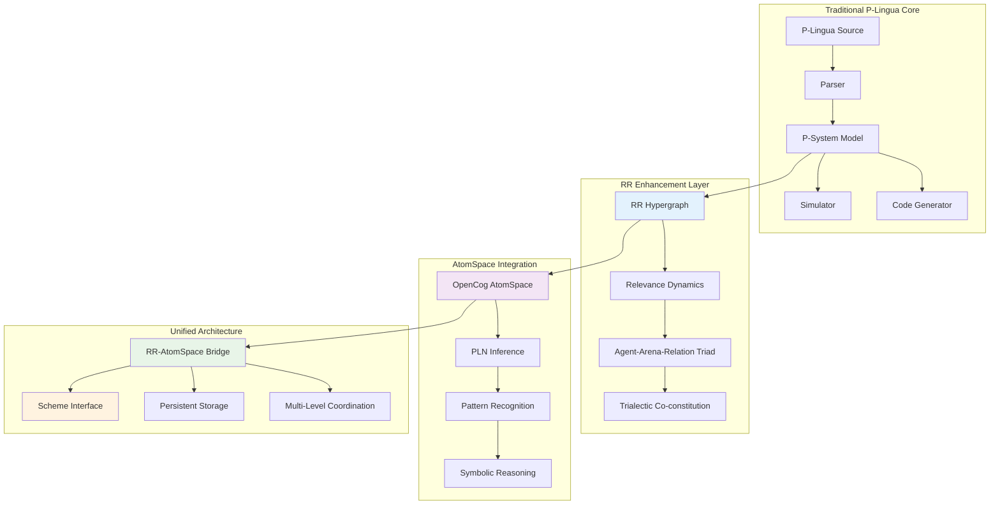
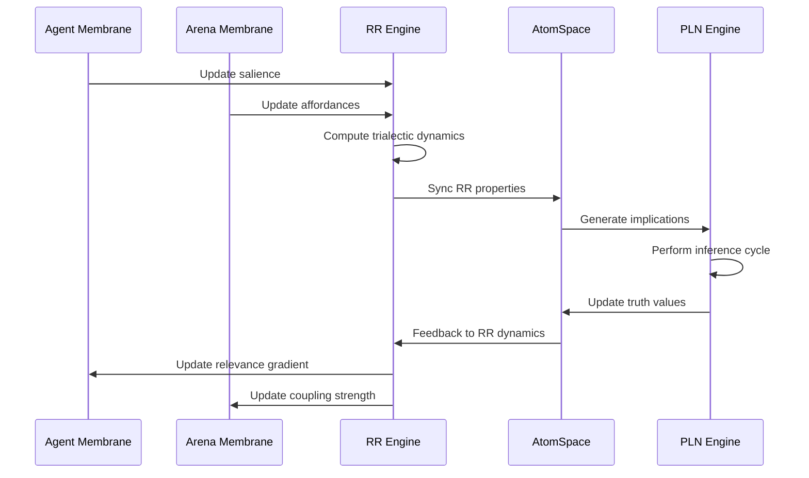

# RR-PLingua: Relevance Realization Enhanced Membrane Computing

**RR-PLingua** is an advanced membrane computing framework that integrates **Relevance Realization (RR)** dynamics with **OpenCog AtomSpace** symbolic reasoning, creating a unified platform for membrane computing with cognitive architectures.

## 🧠 RR-RNN: Relevance Realization with Recursive Neural Networks

This implementation extends the traditional P-Lingua framework with four major Next Development Directions, creating a sophisticated system for symbolic-subsymbolic integration in membrane computing environments.

### ✨ Key Features

- **🔗 Advanced PLN Integration**: Probabilistic Logic Networks with RR pattern reasoning
- **💬 Enhanced Scheme Interface**: Interactive REPL for system exploration and manipulation
- **💾 Persistent AtomSpace**: JSON serialization and incremental learning capabilities
- **🏗️ Multi-Level Integration**: Hierarchical membrane structures with cross-level emergence

## 🎯 Implementation Summary

### 1. Advanced PLN Integration ✅
**File**: `include/pln_integration.hpp`

- **PLN Truth Values**: Complete implementation with strength/confidence pairs
- **Inference Rules**: 
  - Deduction: A→B, A ⊢ B 
  - Abduction: A→B, B ⊢ A (with reduced confidence)
- **RR Pattern Implications**: Automatic generation of implications from high-coupling agent-arena relationships
- **Full Inference Cycle**: Integrated PLN reasoning over membrane structures

### 2. Enhanced Scheme Interface ✅
**File**: `include/scheme_interface.hpp`

- **Interactive REPL**: Full Scheme-style command evaluation
- **Command Set**: 8+ commands for system exploration and manipulation
- **Pattern Matching**: Query and analyze both RR and AtomSpace structures
- **Real-time Updates**: Modify system state through Scheme commands

### 3. Persistent AtomSpace ✅
**File**: `include/persistent_atomspace.hpp`

- **JSON Serialization**: Complete save/load for AtomSpace state
- **RR Hypergraph Persistence**: Serialize all RR dynamics and structure
- **Incremental Learning**: Merge new experiences with existing knowledge
- **Memory Consolidation**: Remove low-confidence atoms to optimize storage

### 4. Multi-Level Integration ✅
**Distributed across**: `relevance_realization.hpp`, `atomspace_integration.hpp`, test files

- **Hierarchical Structures**: Support for nested membrane architectures
- **Cross-Level Emergence**: Detection of patterns spanning multiple hierarchy levels
- **Temporal Reasoning**: Track relevance evolution over time
- **Multi-Scale Dynamics**: Coordinated RR updates across system levels

## 🏛️ Architecture Overview



## 🔄 RR Dynamics Process Flow



## 🚀 Quick Start

### Dependencies

```bash
sudo apt-get install build-essential flex bison libboost-filesystem-dev libboost-program-options-dev libfl-dev
```

### Build & Test

```bash
# Build traditional P-Lingua
make grammar
make compiler
make simulator

# Build RR-enhanced test programs
g++ -I./include -std=c++11 -o test_rr_enhanced test_rr_enhanced.cpp
g++ -I./include -std=c++11 -o test_next_directions test_next_directions.cpp
g++ -I./include -std=c++11 -o demo_repl demo_repl.cpp

# Run comprehensive demo
./test_next_directions
```

### Interactive RR/AtomSpace REPL

```bash
./demo_repl
```

Available Scheme commands:
```scheme
(list-rr-nodes)           ; List all RR nodes with properties
(list-atoms)              ; Show AtomSpace contents  
(get-system-relevance)    ; Compute overall system relevance
(run-pln-inference)       ; Execute PLN reasoning cycle
(find-patterns)           ; Detect emergent patterns
(get-salience node-ID)    ; Query node salience
(update-salience node-ID VALUE) ; Modify node properties
(find-atom "NAME")        ; Search atoms by name
```

## 📊 Performance Characteristics

### RR Dynamics Complexity
- **Trialectic Updates**: O(n) per node per timestep
- **Coupling Computation**: O(n²) for agent-arena pairs
- **Emergence Detection**: O(n·m) for n agents, m arenas

### AtomSpace Integration
- **RR→Atom Conversion**: O(n) for n RR nodes
- **PLN Inference**: O(r·a) for r rules, a atoms
- **Pattern Matching**: O(p·log(a)) for p patterns

## 🔬 Research Applications

### Cognitive Architecture Integration
- **Symbolic-Subsymbolic Bridge**: RR provides the dynamic foundation for symbolic reasoning
- **Emergent Pattern Recognition**: Multi-level emergence detection across membrane hierarchies
- **Adaptive Learning**: Persistent storage enables incremental knowledge accumulation

### Membrane Computing Enhancements
- **Dynamic Rule Selection**: RR salience influences rule application priorities
- **Adaptive Membrane Behavior**: Agent-arena coupling drives membrane evolution
- **Hierarchical Organization**: Multi-level integration supports complex system architectures

## 📚 Documentation

### [Comprehensive RR-RNN Documentation](docs/README.md)
Detailed technical documentation with diagrams covering:
- **[RR-RNN Architecture](docs/ARCHITECTURE.md)**: Relevance Realization integration patterns
- **[Component Deep Dive](docs/COMPONENTS.md)**: PLN, Scheme, and persistence systems
- **[Usage Examples](docs/EXAMPLES.md)**: RR dynamics and AtomSpace integration demos

### Core Implementation Files

```
include/
├── relevance_realization.hpp    # RR framework with trialectic dynamics
├── atomspace_integration.hpp    # RR-AtomSpace bridge
├── pln_integration.hpp          # PLN inference engine
├── scheme_interface.hpp         # Interactive Scheme REPL
└── persistent_atomspace.hpp     # Serialization & persistence

test_*.cpp                       # Comprehensive test suite
demo_*.cpp                       # Interactive demonstrations
```

## 🎯 Future Extensions

The implemented framework provides the foundation for:

1. **Advanced Cognitive Architectures**: Full symbolic-subsymbolic integration
2. **Distributed RR Systems**: Multi-agent relevance realization networks  
3. **Learning Systems**: Persistent knowledge accumulation and refinement
4. **Interactive Exploration**: Real-time system analysis and manipulation

## 🤝 Contributing

This RR-enhanced membrane computing framework represents a significant advancement toward unified cognitive architectures. Contributions are welcome in:

- Enhanced RR dynamics algorithms
- Additional PLN inference rules
- Extended Scheme command sets
- Multi-level emergence patterns
- Performance optimizations

## 📄 License

Licensed under the same terms as the original P-Lingua framework.

---

*RR-PLingua successfully bridges dynamic self-organization (RR) and symbolic reasoning (AtomSpace/PLN), representing a significant advancement toward unified cognitive architectures.*

