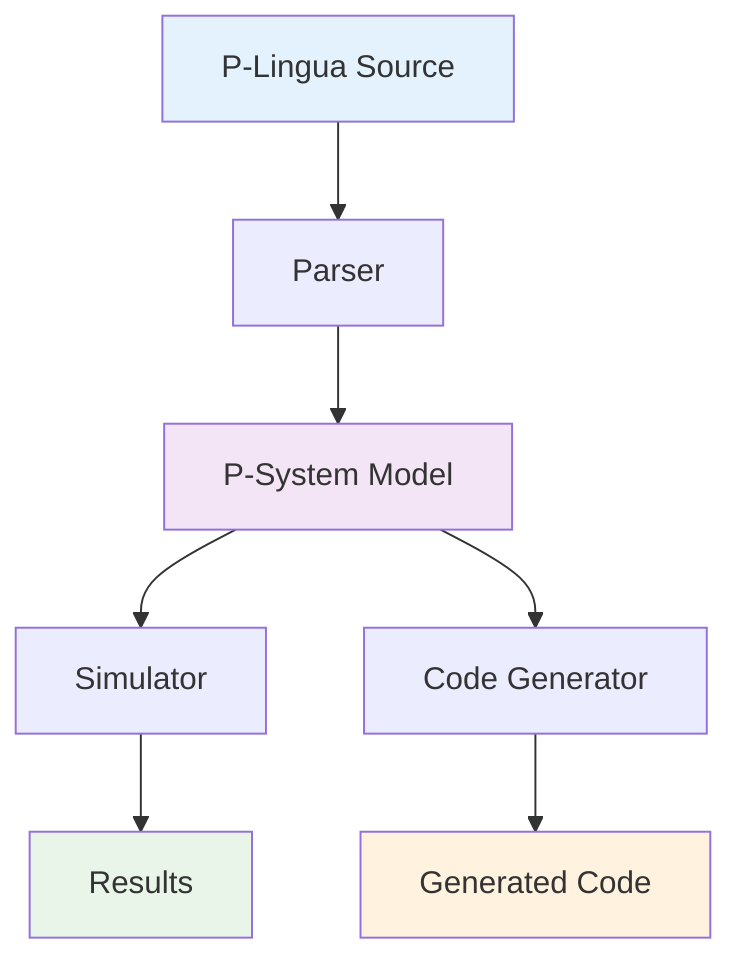

# plingua
The P-Lingua language for Membrane Computing

P-Lingua is a comprehensive framework for membrane computing that provides a complete ecosystem for defining, parsing, simulating, and generating code for P-systems (membrane systems).

## 📚 Documentation

### [Comprehensive Architecture Documentation](docs/README.md)
Detailed architectural insights with Mermaid diagrams covering:
- **[System Architecture](docs/ARCHITECTURE.md)**: High-level design patterns and data flows
- **[Component Deep Dive](docs/COMPONENTS.md)**: Internal architecture of parser, simulator, and generator
- **[Usage Examples](docs/EXAMPLES.md)**: Practical demonstrations and integration guides

## Dependencies 

* Linux OS (tested on Ubuntu 16.04 and Ubuntu 18.04)
* GCC 4.9.0 or higher (with support for regex)
* Flex
* Bison
* libboost-filesystem-dev 
* libboost-program-options-dev

sudo apt-get install build-essential flex bison libboost-filesystem-dev libboost-program-options-dev 

## Compiling

* make grammar
* make compiler
* make simulator
* sudo make install

## Architecture Overview

The framework consists of three main components:
- **Parser**: Transforms P-Lingua source into executable models
- **Simulator**: Executes membrane computing simulations
- **Generator**: Produces optimized C++ implementations

