# RR-Enhanced P-Lingua Architecture Documentation

## Overview

**RR-PLingua** is a revolutionary enhancement of the traditional P-Lingua framework that integrates **Relevance Realization (RR)** dynamics with **OpenCog AtomSpace** symbolic reasoning. This creates a sophisticated platform for cognitive membrane computing that bridges symbolic and subsymbolic processing.

The enhanced system provides four major architectural innovations:
1. **PLN Integration** - Probabilistic Logic Networks for uncertain reasoning
2. **Scheme Interface** - Interactive exploration and manipulation
3. **Persistent Storage** - Knowledge accumulation and memory consolidation  
4. **Multi-Level Integration** - Hierarchical emergence detection

## High-Level System Architecture

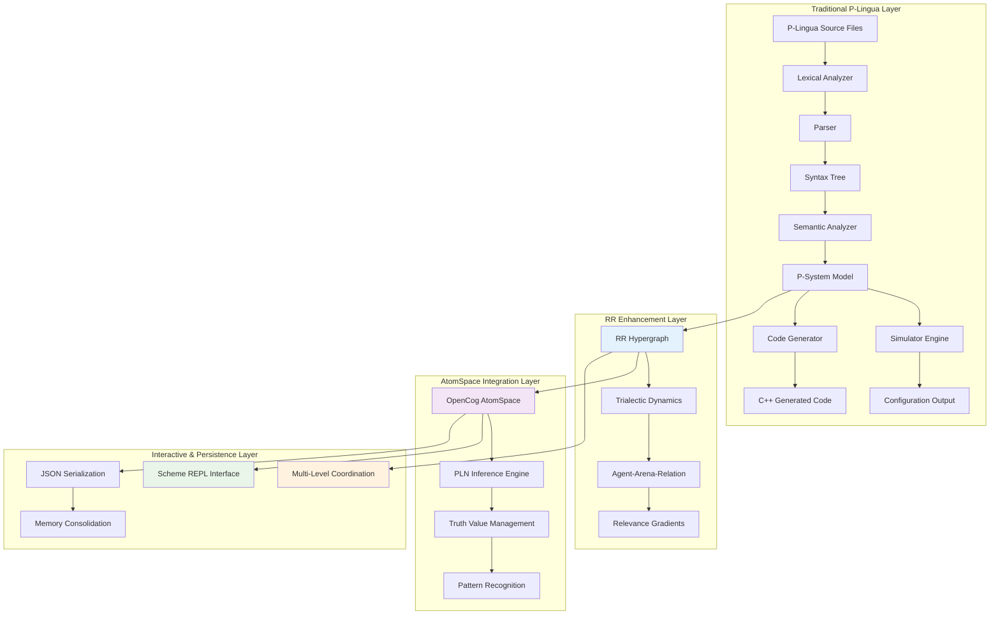

## Core Data Structures

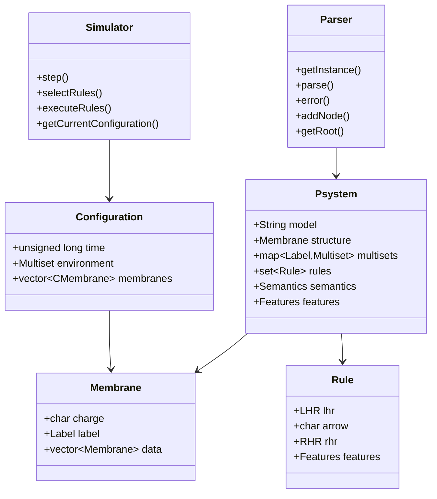

## Module Interaction Architecture

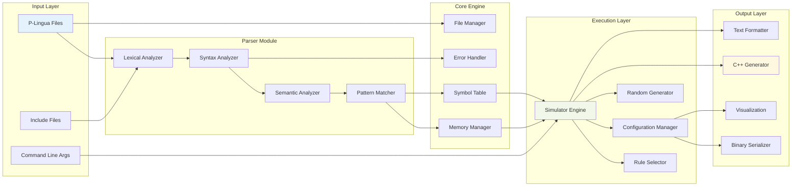

## Parsing Data Flow

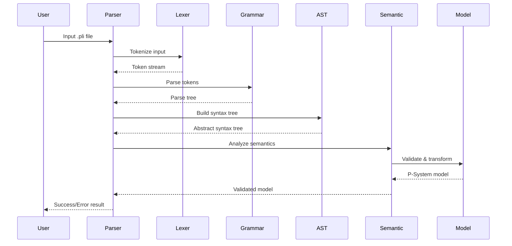

## Simulation Execution Flow

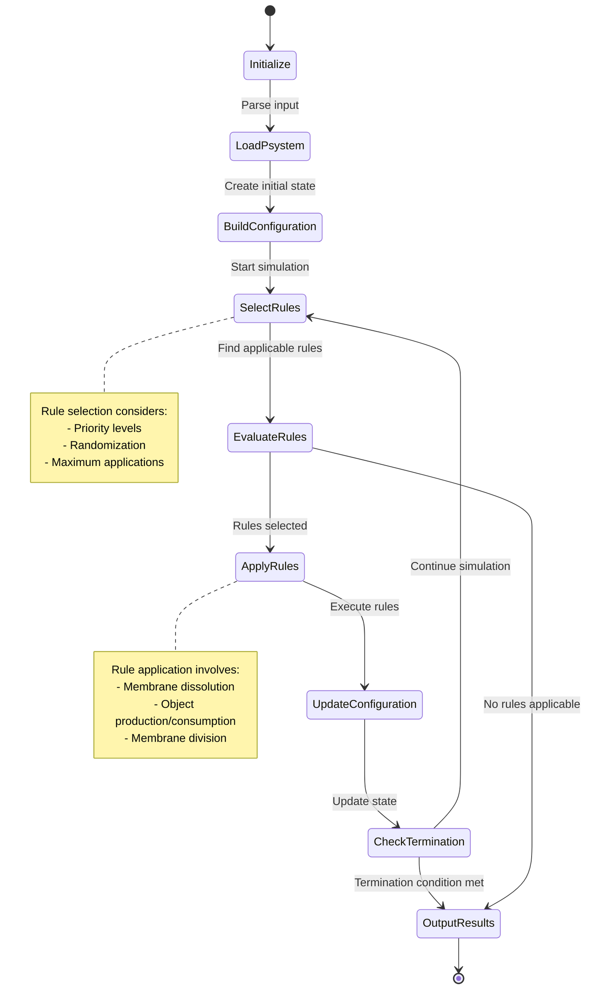

## Memory and Object Management

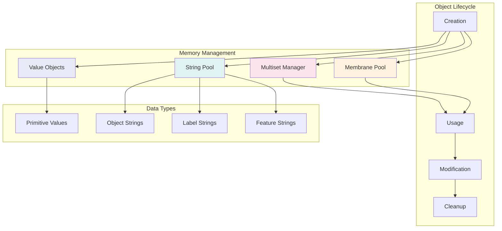

## Code Generation Architecture

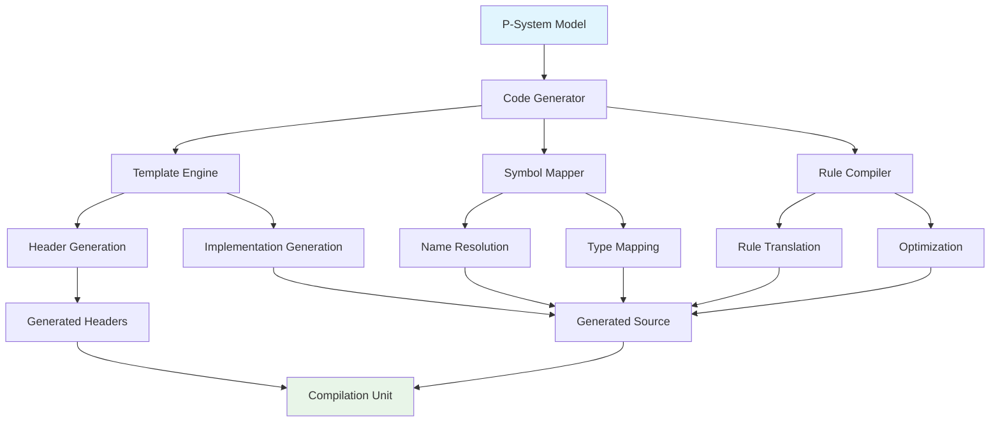

## Error Handling and Diagnostics

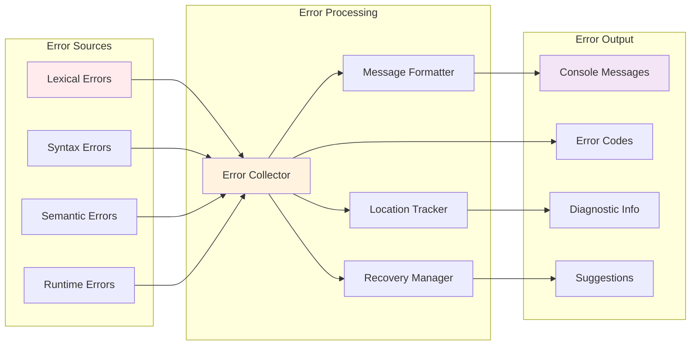

## File I/O and Serialization

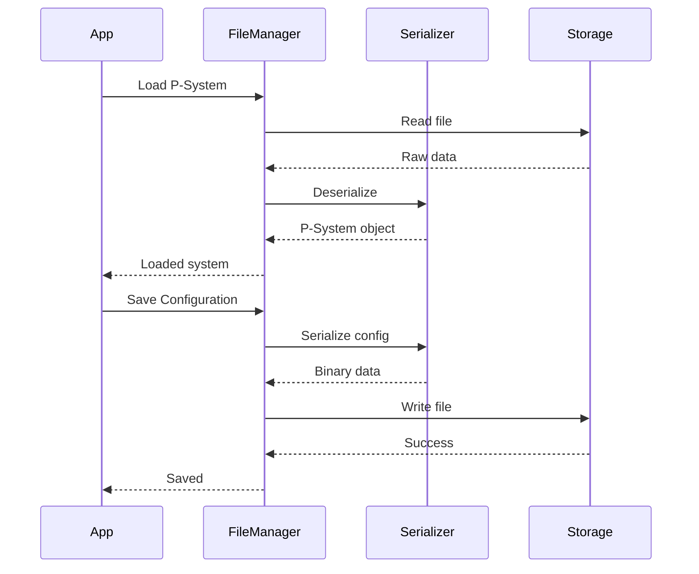

## Extension and Plugin Architecture

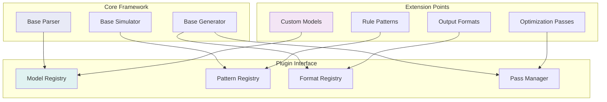

## Performance and Optimization

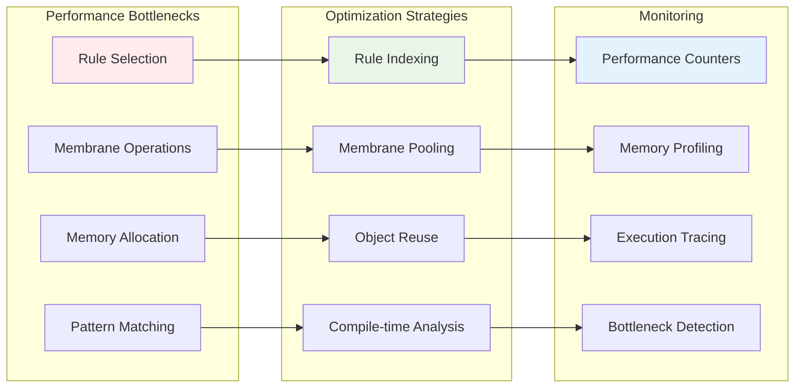

## Conclusion

This architecture documentation provides a comprehensive view of the P-Lingua framework's design and implementation. The system demonstrates sophisticated patterns for domain-specific language processing, including robust parsing, flexible simulation engines, and extensible code generation capabilities.

Key architectural strengths include:
- **Modular Design**: Clear separation between parsing, simulation, and generation
- **Extensibility**: Plugin architecture for custom models and optimizations  
- **Performance**: Optimized data structures and algorithms for membrane computing
- **Robustness**: Comprehensive error handling and diagnostics
- **Maintainability**: Well-structured codebase with clear interfaces

The framework serves as an excellent foundation for membrane computing research and applications, providing both high-level abstractions and low-level control when needed.