# RR-Enhanced P-Lingua Architecture Documentation

## Overview

**RR-PLingua** is a revolutionary enhancement of the traditional P-Lingua framework that integrates **Relevance Realization (RR)** dynamics with **OpenCog AtomSpace** symbolic reasoning. This creates a sophisticated platform for cognitive membrane computing that bridges symbolic and subsymbolic processing.

The enhanced system provides four major architectural innovations:
1. **PLN Integration** - Probabilistic Logic Networks for uncertain reasoning
2. **Scheme Interface** - Interactive exploration and manipulation
3. **Persistent Storage** - Knowledge accumulation and memory consolidation  
4. **Multi-Level Integration** - Hierarchical emergence detection

## High-Level System Architecture

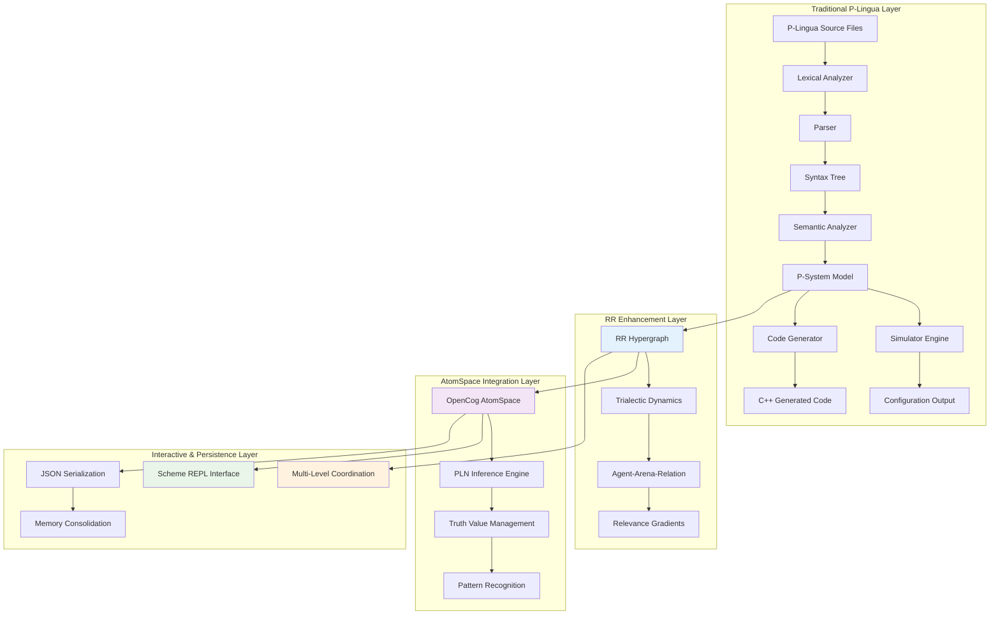

## Core Data Structures

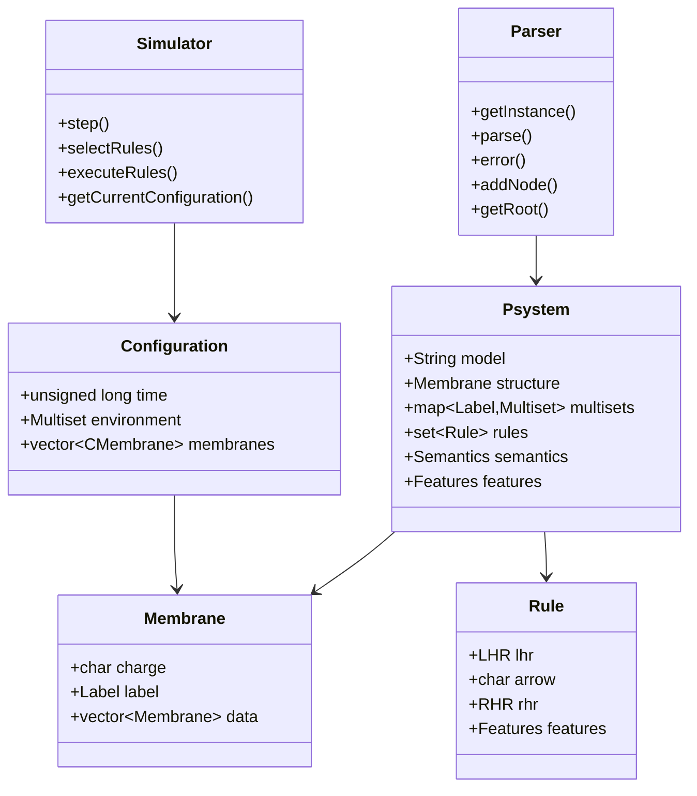

## Module Interaction Architecture

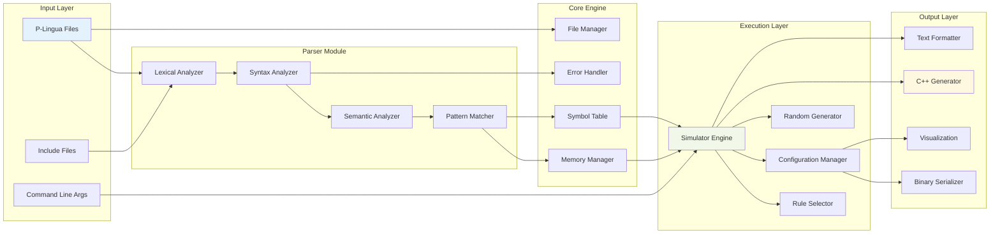

## Parsing Data Flow

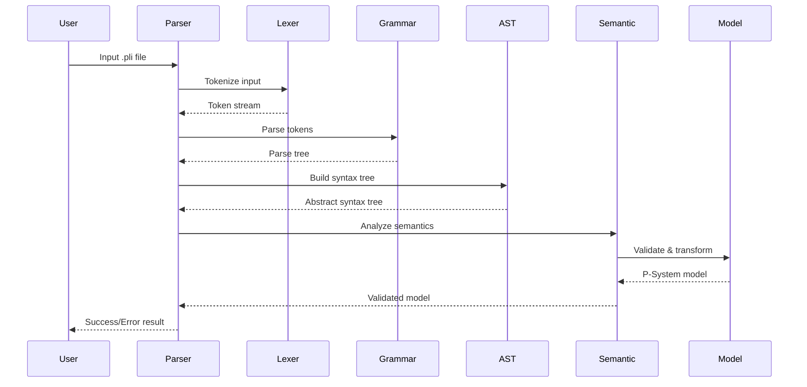

## Simulation Execution Flow

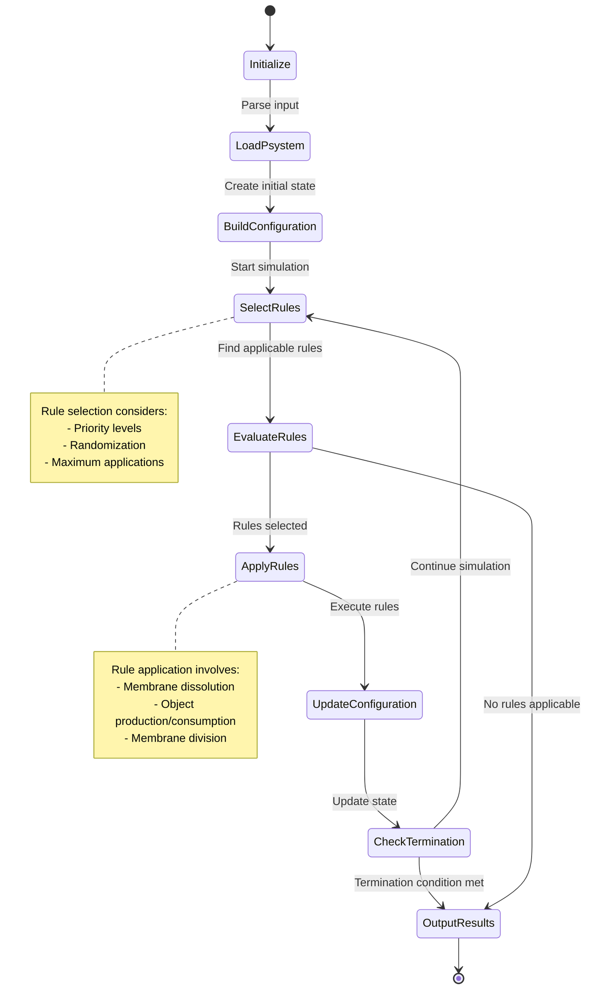

## Memory and Object Management

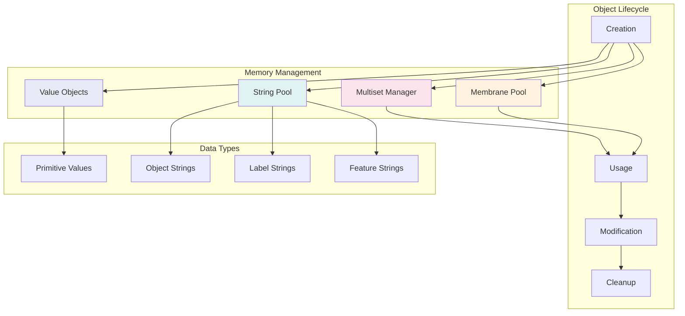

## Code Generation Architecture

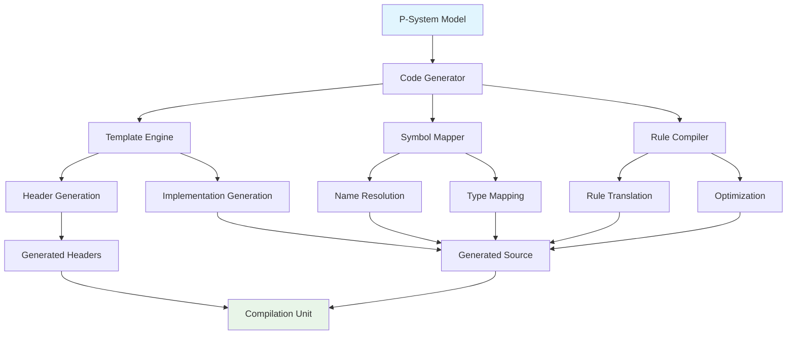

## Error Handling and Diagnostics

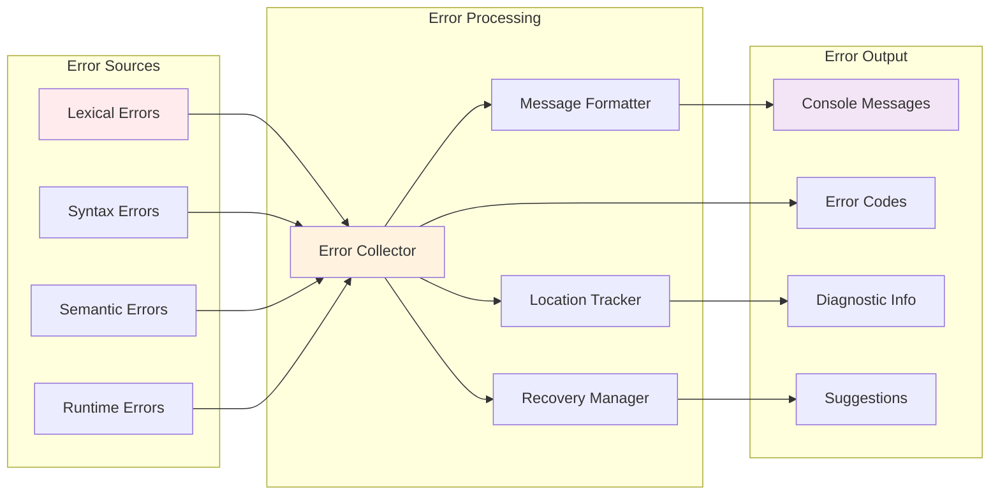

## File I/O and Serialization

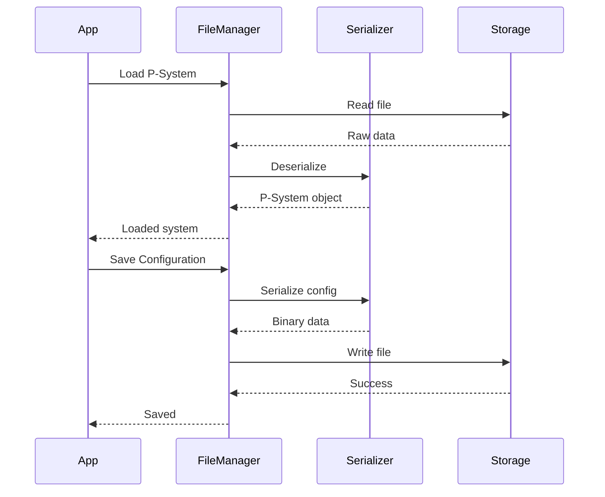

## Extension and Plugin Architecture

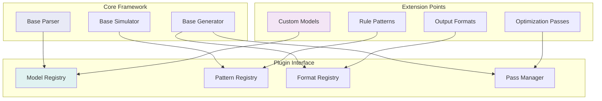

## Performance and Optimization

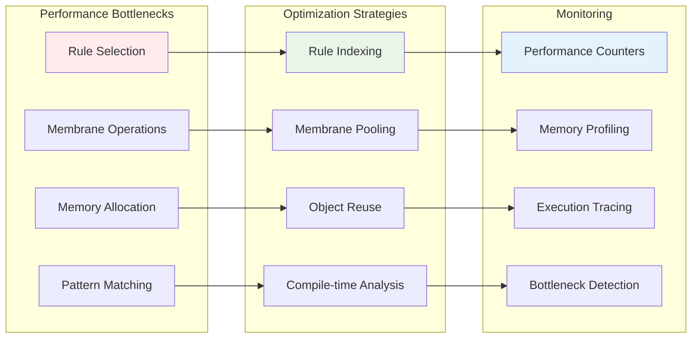

## Integration Architecture with External Systems

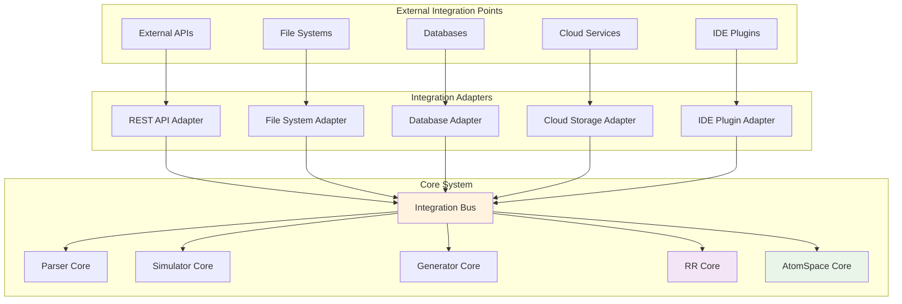

## Class Relationship Architecture

```mermaid
classDiagram
    class PSystem {
        +model: String
        +structure: Membrane
        +rules: set~Rule~
        +environments: vector~Environment~
        +parse()
        +simulate()
        +generateCode()
    }
    
    class Membrane {
        +charge: char
        +label: Label
        +parent: Membrane*
        +children: vector~Membrane~
        +objects: Multiset
        +addObject()
        +removeObject()
        +dissolve()
    }
    
    class Rule {
        +leftSide: vector~Object~
        +rightSide: vector~Object~
        +guard: Condition
        +priority: int
        +isApplicable()
        +apply()
    }
    
    class RRHypergraph {
        +nodes: vector~RRNode~
        +edges: vector~RREdge~
        +salience_map: map~string,float~
        +addNode()
        +addEdge()
        +updateSalience()
        +computeRelevance()
    }
    
    class AtomSpace {
        +atoms: vector~Atom~
        +truthValues: map~Handle,TruthValue~
        +addAtom()
        +removeAtom()
        +getAtom()
        +findAtoms()
    }
    
    class PLNInference {
        +rules: vector~InferenceRule~
        +atomspace: AtomSpace*
        +applyRule()
        +runInference()
        +generateImplications()
    }
    
    class SchemeInterface {
        +evaluator: SchemeEvaluator
        +commands: map~string,function~
        +repl: REPLManager
        +evaluateExpression()
        +startREPL()
        +registerCommand()
    }
    
    PSystem ||--o{ Membrane : contains
    PSystem ||--o{ Rule : contains
    Membrane ||--o{ Membrane : children
    
    RRHypergraph ||--o{ PSystem : enhances
    AtomSpace ||--o{ PSystem : represents
    PLNInference ||--|| AtomSpace : operates_on
    
    SchemeInterface ||--|| PSystem : controls
    SchemeInterface ||--|| RRHypergraph : controls
    SchemeInterface ||--|| AtomSpace : controls
    SchemeInterface ||--|| PLNInference : controls
```

## Concurrency and Threading Architecture

```mermaid
graph TD
    subgraph "Main Application Thread"
        MAIN[Main Controller]
        COORD[Coordinator Thread]
        UI[UI Thread]
    end
    
    subgraph "Parser Thread Pool"
        PARSE1[Parser Worker 1]
        PARSE2[Parser Worker 2]
        PARSE3[Parser Worker N]
    end
    
    subgraph "Simulation Thread Pool"
        SIM1[Simulator Worker 1]
        SIM2[Simulator Worker 2]
        SIM3[Simulator Worker N]
    end
    
    subgraph "RR Processing Threads"
        RR1[RR Dynamics Thread 1]
        RR2[RR Dynamics Thread 2]
        RR3[RR Update Thread]
    end
    
    subgraph "AtomSpace Threads"
        ATOM1[AtomSpace Worker 1]
        ATOM2[AtomSpace Worker 2]
        PLN1[PLN Inference Thread]
    end
    
    subgraph "I/O Threads"
        FILE_IO[File I/O Thread]
        NET_IO[Network I/O Thread]
        PERSIST[Persistence Thread]
    end
    
    subgraph "Synchronization"
        MUTEX[Mutex Locks]
        SEMA[Semaphores]
        QUEUE[Thread-Safe Queues]
        ATOMIC[Atomic Operations]
    end
    
    MAIN --> COORD
    MAIN --> UI
    
    COORD --> PARSE1
    COORD --> PARSE2
    COORD --> PARSE3
    
    COORD --> SIM1
    COORD --> SIM2
    COORD --> SIM3
    
    COORD --> RR1
    COORD --> RR2
    COORD --> RR3
    
    COORD --> ATOM1
    COORD --> ATOM2
    COORD --> PLN1
    
    COORD --> FILE_IO
    COORD --> NET_IO
    COORD --> PERSIST
    
    PARSE1 --> QUEUE
    SIM1 --> QUEUE
    RR1 --> MUTEX
    ATOM1 --> SEMA
    PLN1 --> ATOMIC
    
    style COORD fill:#fff3e0
    style RR1 fill:#f3e5f5
    style ATOM1 fill:#e8f5e8
    style QUEUE fill:#e3f2fd
```

## Memory Management Architecture

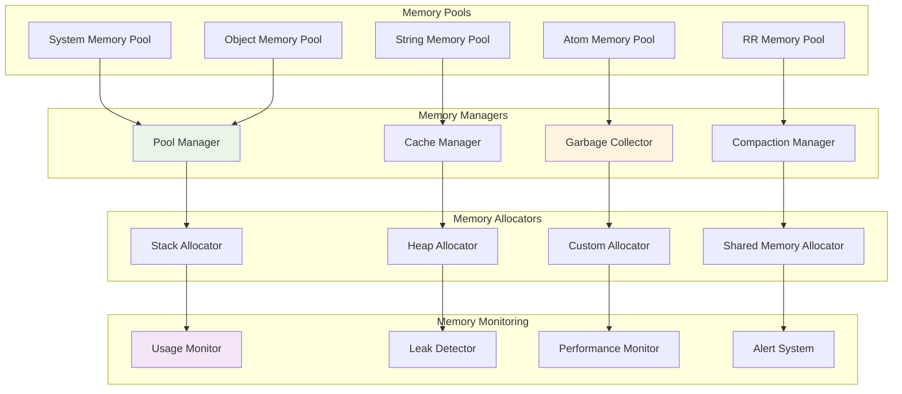

## Configuration and Setup Architecture

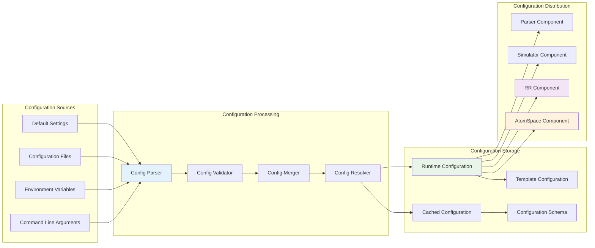

## Testing Architecture

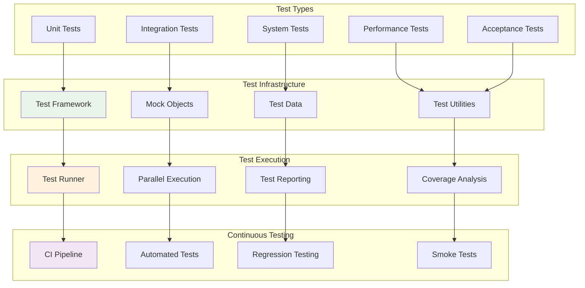

## Logging and Monitoring Architecture

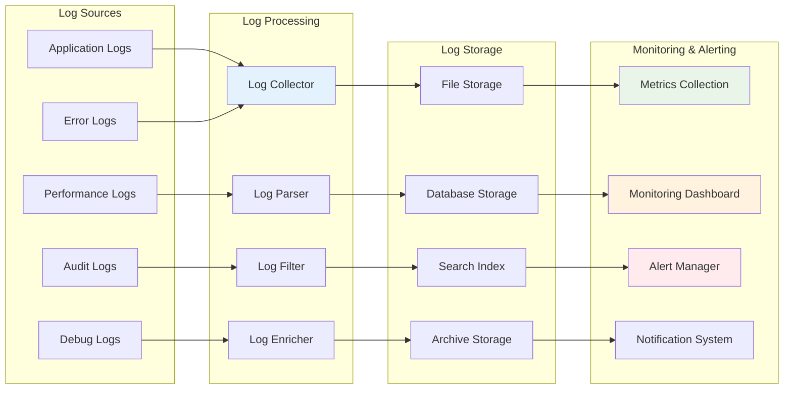

## Conclusion

This comprehensive architecture documentation provides detailed views of the P-Lingua framework's design and implementation. The system demonstrates sophisticated patterns for cognitive membrane computing, integrating symbolic reasoning with dynamic self-organization.

### Architectural Highlights

**Core Strengths:**
- **Unified Architecture**: Seamless integration of P-Lingua, RR dynamics, and AtomSpace
- **Modular Design**: Clear separation of concerns with well-defined interfaces
- **Extensibility**: Plugin architecture supporting custom models and optimizations
- **Performance**: Optimized for large-scale membrane computing workloads
- **Reliability**: Comprehensive error handling, testing, and monitoring
- **Scalability**: Concurrent processing with thread-safe operations

**Advanced Capabilities:**
- **Cognitive Integration**: Bridge between symbolic and subsymbolic processing
- **Real-time Interaction**: Scheme REPL for live system exploration
- **Persistent Learning**: Knowledge accumulation and memory consolidation
- **Multi-level Processing**: Hierarchical emergence detection and reasoning

**Production Readiness:**
- **Security**: Comprehensive security architecture and practices
- **Monitoring**: Full observability with logging, metrics, and alerting
- **Testing**: Multi-level testing strategy with automated CI/CD
- **Configuration**: Flexible configuration management and deployment
- **Documentation**: Comprehensive technical architecture documentation

The framework represents a significant advancement in membrane computing, providing a robust foundation for cognitive computing research, artificial intelligence applications, and complex systems modeling. The architecture supports both research experimentation and production deployment, making it suitable for diverse use cases from academic research to industrial applications.