# P-Lingua Component Deep Dive

## Parser Component Architecture

The parser component is the heart of P-Lingua's language processing pipeline, responsible for transforming P-Lingua source code into executable P-system models.

### Parser Internal Architecture

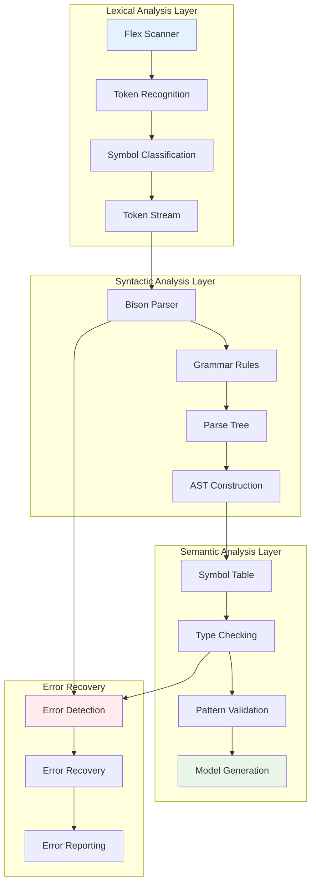

### Parser State Management

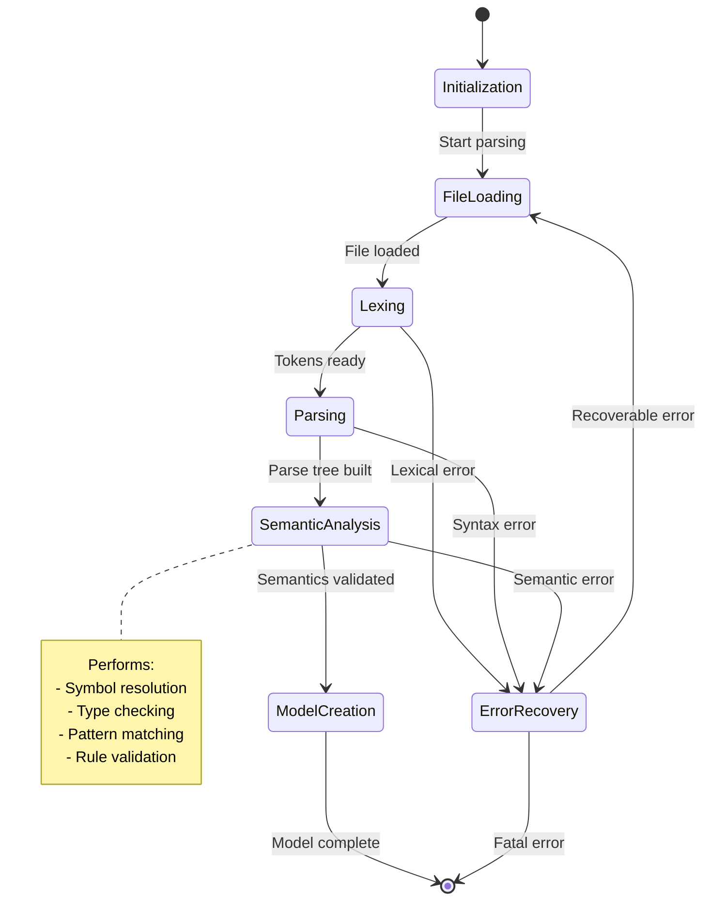

### Pattern Matching System

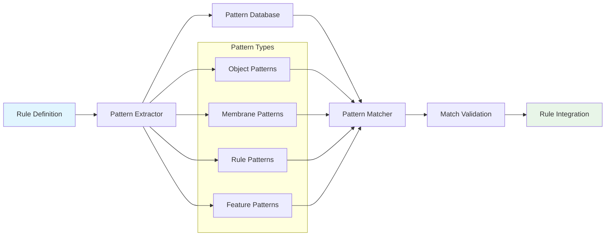

## Simulator Component Architecture

The simulator executes P-system models by applying evolution rules and managing membrane configurations.

### Simulation Engine Core

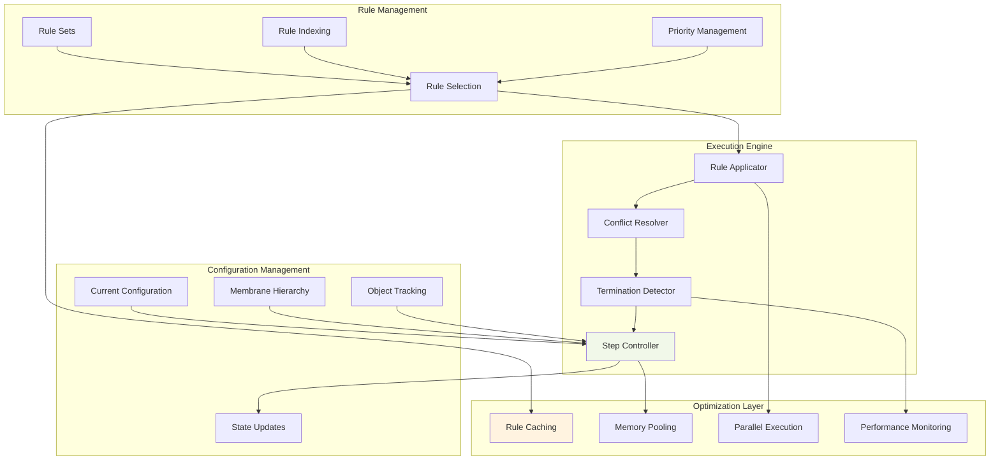

### Rule Selection Algorithm

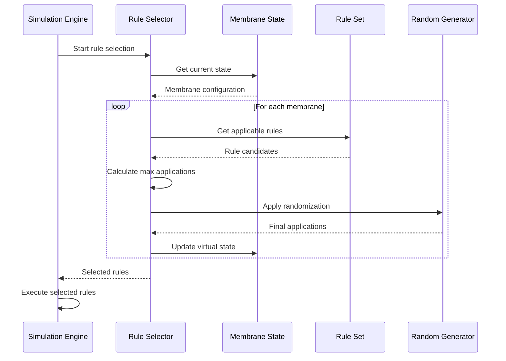

### Memory Management in Simulation

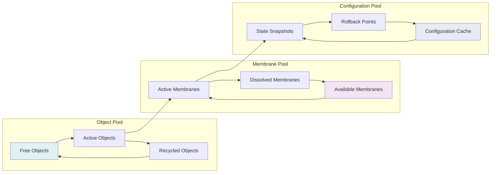

## Code Generator Architecture

The code generator transforms P-system models into efficient C++ implementations.

### Generation Pipeline

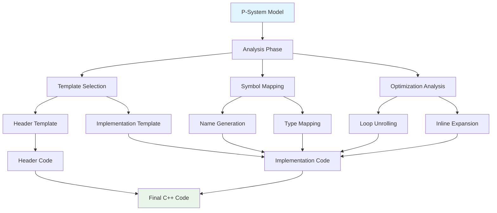

### Code Templates and Patterns

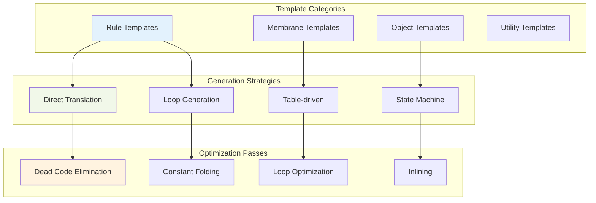

## Data Serialization Architecture

The serialization system provides persistent storage and exchange of P-system models and configurations.

### Serialization Framework

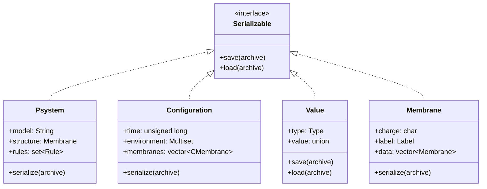

### Binary Format Structure

```mermaid
graph LR
    subgraph "File Header"
        A[Magic Number]
        B[Version Info]
        C[Metadata]
    end
    
    subgraph "Model Section"
        D[P-System Model]
        E[Rules Data]
        F[Structure Data]
    end
    
    subgraph "Configuration Section"
        G[Initial Config]
        H[Membrane States]
        I[Object Counts]
    end
    
    subgraph "Footer"
        J[Checksums]
        K[Index Table]
    end
    
    A --> B
    B --> C
    C --> D
    D --> E
    E --> F
    F --> G
    G --> H
    H --> I
    I --> J
    J --> K
    
    style A fill:#e3f2fd
    style D fill:#f1f8e9
    style G fill:#fff3e0
    style J fill:#ffebee
```

## Inter-Component Communication

### Message Passing Architecture

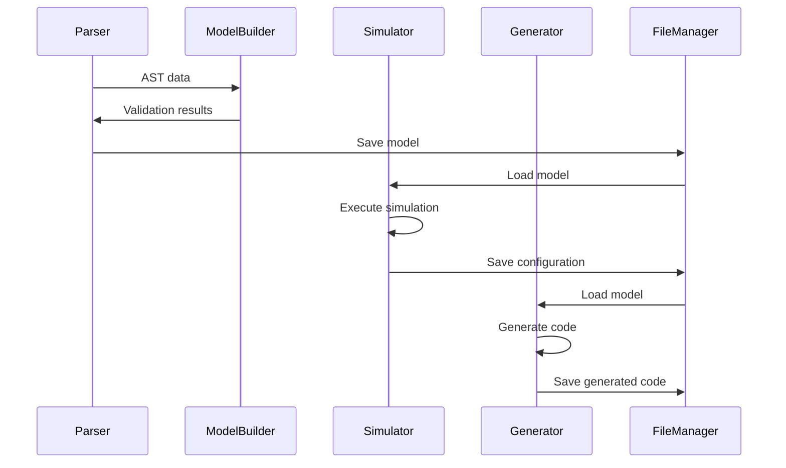

### Event System

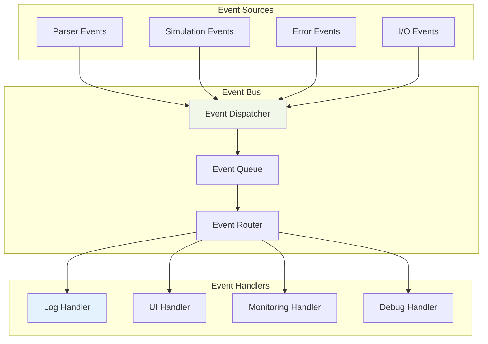

## Thread Safety and Concurrency

### Concurrent Execution Model

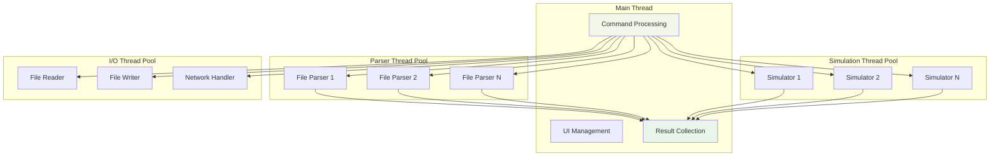

### Synchronization Mechanisms

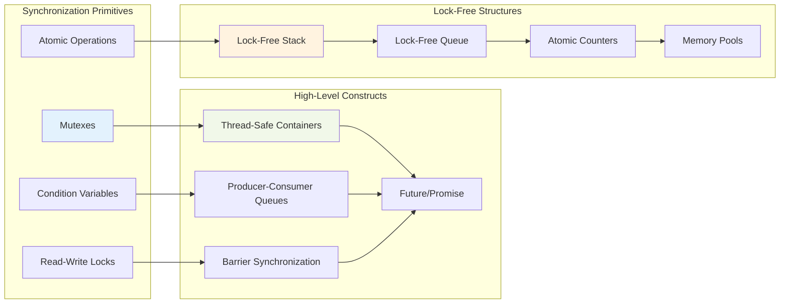

This deep dive into P-Lingua's component architecture reveals the sophisticated design patterns and engineering decisions that make the framework both powerful and maintainable. Each component is designed with clear responsibilities and well-defined interfaces, enabling extensibility and optimization.