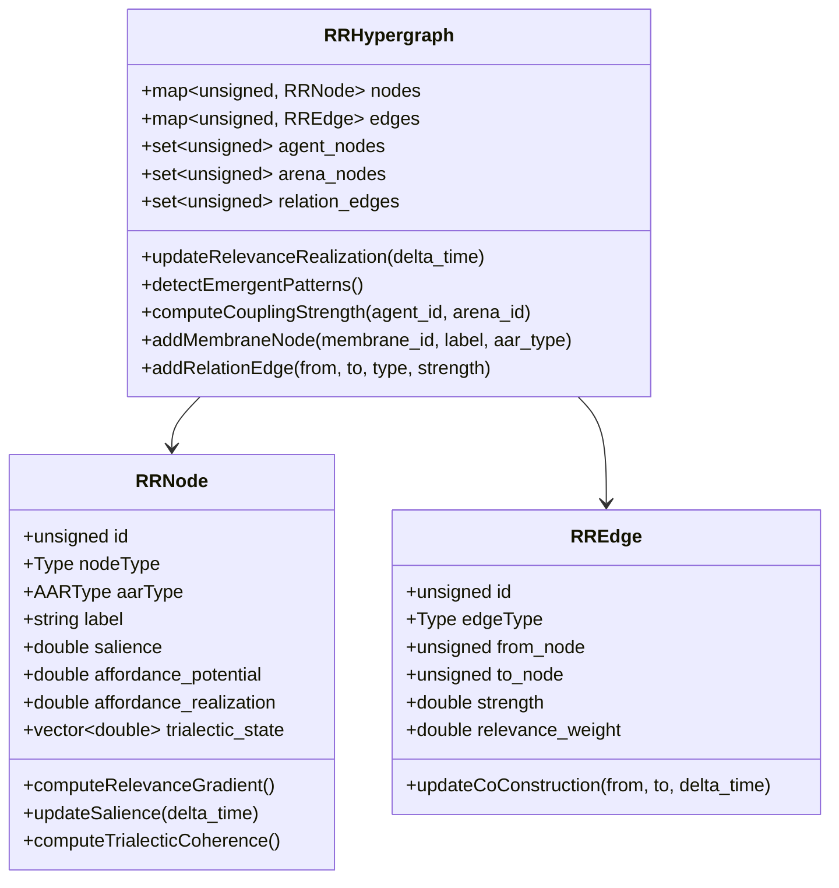
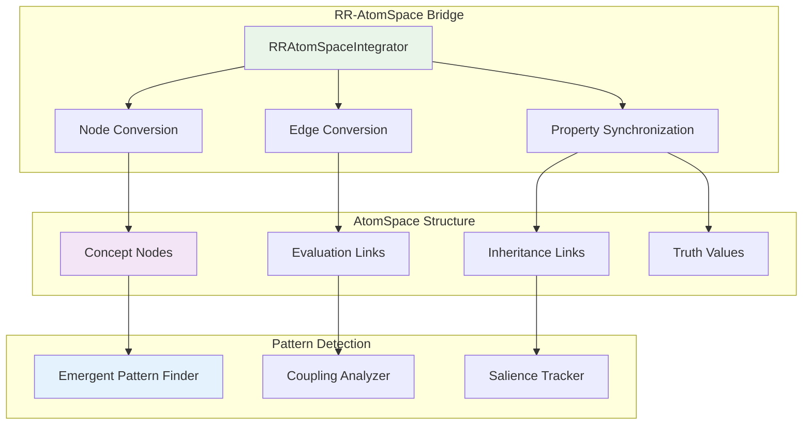
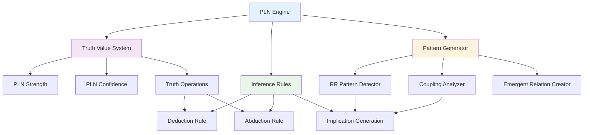
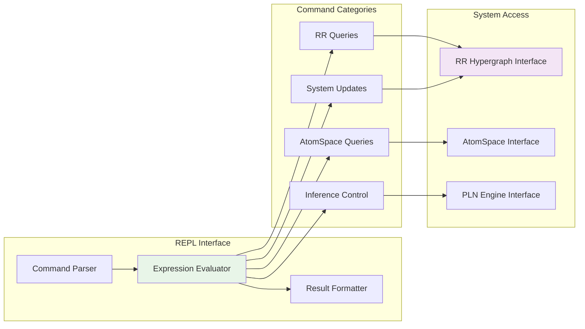
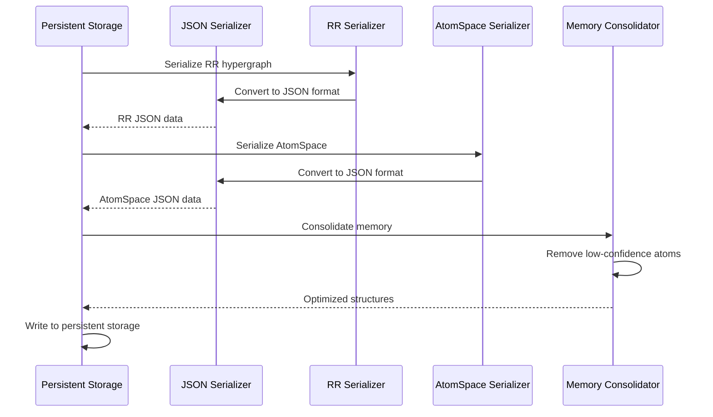
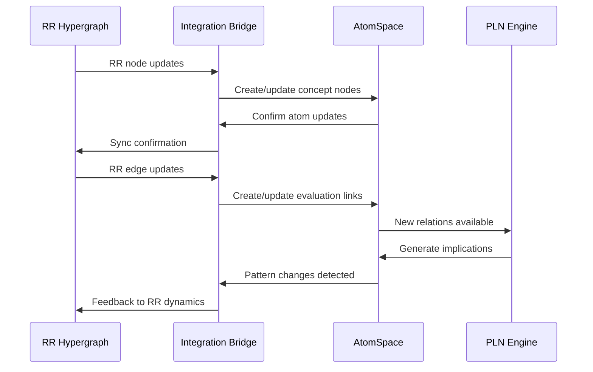

# RR-Enhanced P-Lingua Component Deep Dive

This document provides detailed analysis of both traditional P-Lingua components and the new RR-enhanced cognitive architecture components.

## Traditional P-Lingua Components

### Parser Component Architecture

The parser component is the heart of P-Lingua's language processing pipeline, responsible for transforming P-Lingua source code into executable P-system models.

### Parser Internal Architecture


### Parser State Management


### Pattern Matching System


## Simulator Component Architecture

The simulator executes P-system models by applying evolution rules and managing membrane configurations.

### Simulation Engine Core


### Rule Selection Algorithm


### Memory Management in Simulation


## Code Generator Architecture

The code generator transforms P-system models into efficient C++ implementations.

### Generation Pipeline


### Code Templates and Patterns


## Data Serialization Architecture

The serialization system provides persistent storage and exchange of P-system models and configurations.

### Serialization Framework


### Binary Format Structure


## Inter-Component Communication

### Message Passing Architecture


### Event System


## Thread Safety and Concurrency

### Concurrent Execution Model


### Synchronization Mechanisms


This deep dive into P-Lingua's component architecture reveals the sophisticated design patterns and engineering decisions that make the framework both powerful and maintainable. Each component is designed with clear responsibilities and well-defined interfaces, enabling extensibility and optimization.

## RR-Enhanced Components

The RR enhancement layer adds four major component systems that transform traditional membrane computing into a cognitive architecture platform.

### RR Hypergraph Component

The RR Hypergraph is the core component that implements Relevance Realization dynamics through trialectic co-constitution.



### AtomSpace Integration Component

The AtomSpace Integration bridges RR dynamics with symbolic reasoning through OpenCog AtomSpace.



### PLN Integration Component

The PLN Integration component provides probabilistic logic reasoning over the integrated RR-AtomSpace structures.



### Scheme Interface Component

The Scheme Interface provides interactive exploration and manipulation capabilities.



### Persistent Storage Component

The Persistent Storage component handles serialization, memory consolidation, and incremental learning.



## Component Interaction Patterns

### RR-AtomSpace Synchronization



### Multi-Level Emergence Detection

```mermaid
graph TD
    subgraph "Level Monitoring"
        A[Agent Salience Monitor]
        B[Arena Coupling Monitor]
        C[Cross-Level Pattern Detector]
    end
    
    subgraph "Emergence Criteria"
        D[High Salience: > 0.8]
        E[Strong Coupling: > 0.8]
        F[High Coherence: > 0.6]
    end
    
    subgraph "Emergence Actions"
        G[Create Emergent Relation]
        H[Update Multi-Level State]
        I[Record Emergence Event]
    end
    
    A --> D
    B --> E
    C --> F
    
    D --> G
    E --> G
    F --> G
    
    G --> H
    H --> I
    
    style A fill:#e3f2fd
    style G fill:#e8f5e8
```

This enhanced component architecture demonstrates how RR-PLingua successfully integrates dynamic self-organization with symbolic reasoning, creating a sophisticated platform for cognitive membrane computing applications.