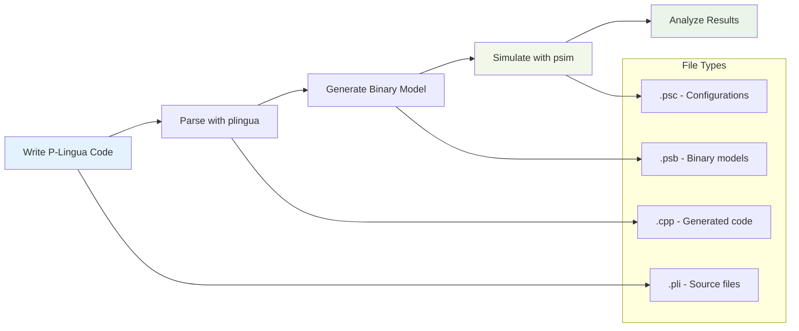
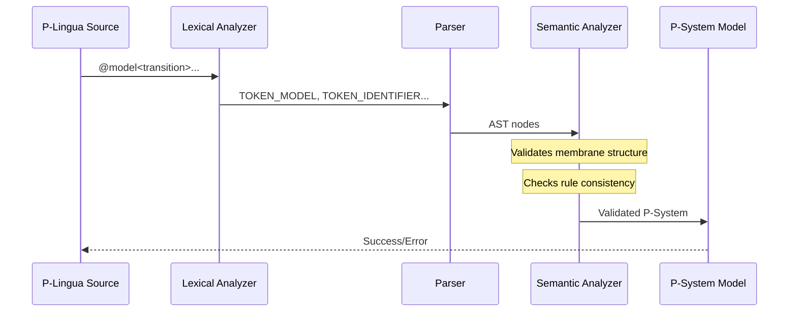
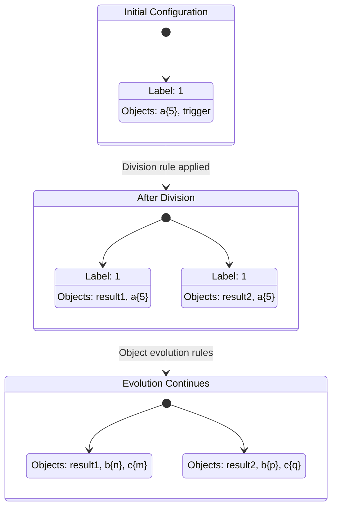
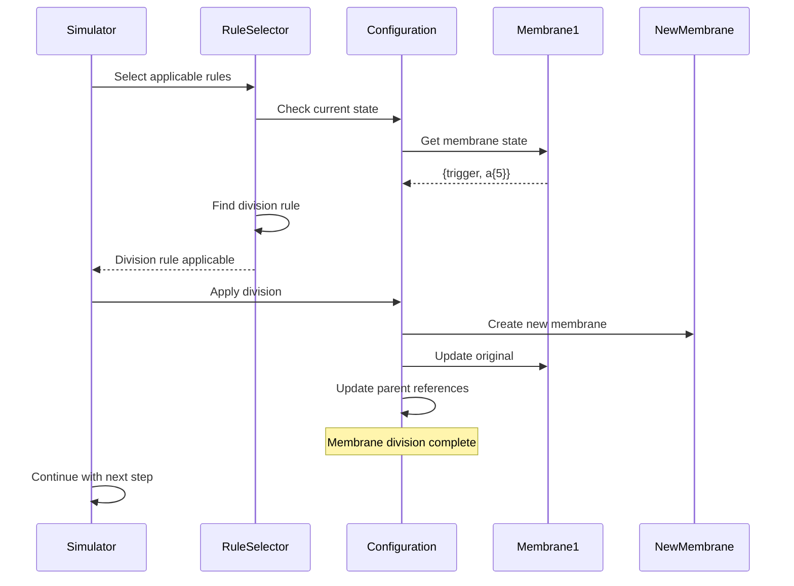
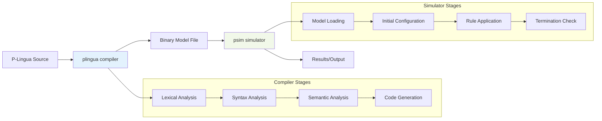
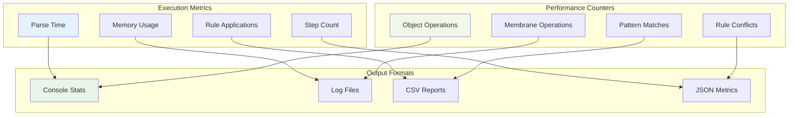
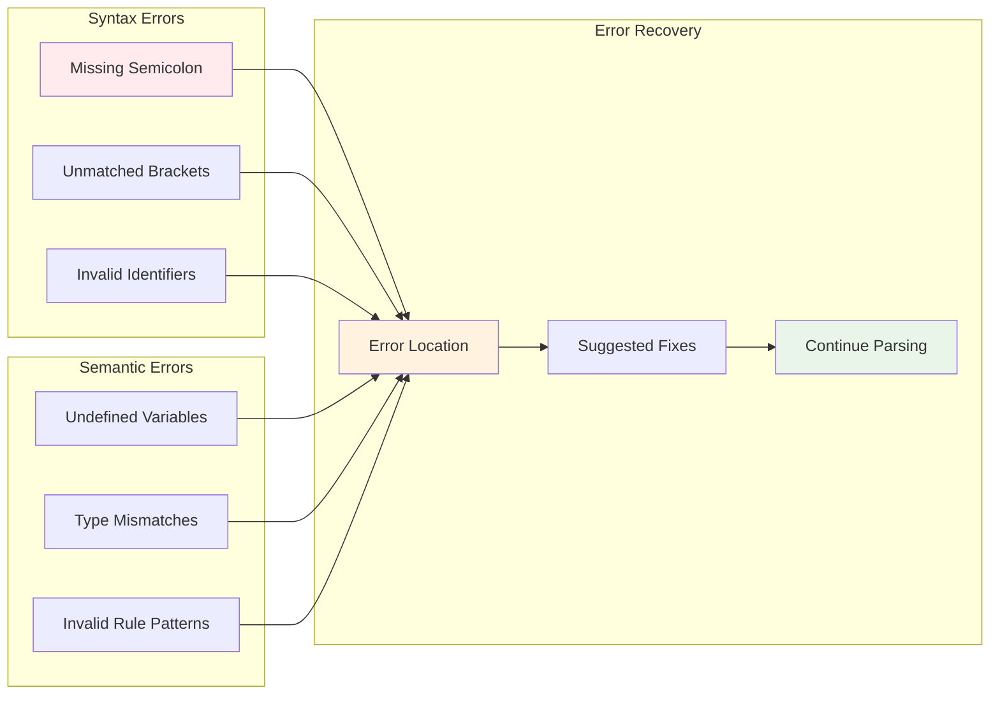
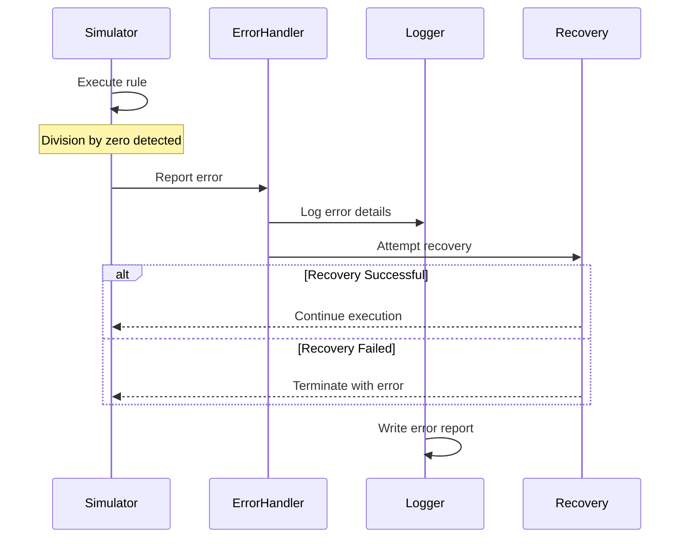
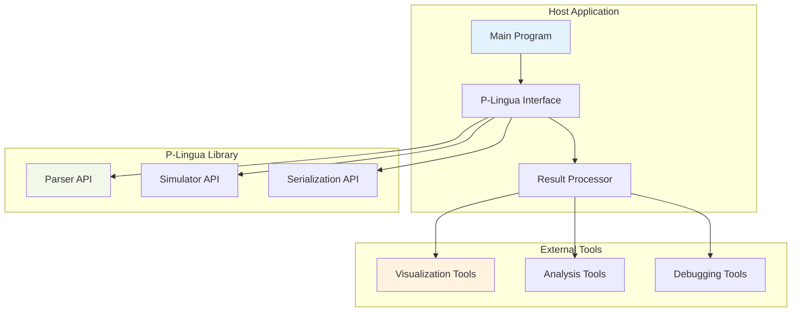

# P-Lingua Usage and Examples

## Introduction

This document demonstrates the practical usage of P-Lingua through detailed examples, showing how the architectural components work together to process membrane computing models.

## Basic Workflow



## Example 1: Simple Membrane System

### P-Lingua Source Code

```plingua
@model<transition>

def main() {
    // Define a simple membrane with objects
    @mu = [a{3}, b{2}]'1;
    
    // Evolution rules
    [a --> b]'1;
    [b --> c]'1;
    [c --> @d]'1;  // dissolution
}
```

### Parsing Process Flow



### Generated Internal Representation

```mermaid
graph TD
    subgraph "P-System Model"
        A[Model: transition]
        B[Initial Structure]
        C[Rules Set]
        D[Semantics]
    end
    
    subgraph "Membrane Structure"
        E[Membrane '1']
        F[Objects: a{3}, b{2}]
        G[Charge: neutral]
    end
    
    subgraph "Evolution Rules"
        H[Rule 1: a → b]
        I[Rule 2: b → c]
        J[Rule 3: c → @d]
    end
    
    A --> B
    A --> C
    A --> D
    
    B --> E
    E --> F
    E --> G
    
    C --> H
    C --> I
    C --> J
    
    style A fill:#e3f2fd
    style E fill:#f1f8e9
    style H fill:#fff3e0
```

## Example 2: Complex Membrane Division

### P-Lingua Source Code

```plingua
@model<transition>

def division_example() {
    // Membrane with division rules
    @mu = [a{5}, trigger]'1;
    
    // Division rule: one membrane becomes two
    [trigger [ ]'1 --> [result1]'1 [result2]'1];
    
    // Object evolution within membranes
    [a --> b]'1;
    [b --> c]'1;
}
```

### Division Process Visualization



### Simulation Step Details



## Example 3: Pattern Matching and Variables

### P-Lingua Source Code

```plingua
@model<transition>

def pattern_example(n) {
    // Parameterized membrane structure
    @mu = [ ]'1;
    @ms(1) += obj{i} : 1 <= i <= n;
    
    // Pattern-based rules with variables
    [obj{x}, obj{y} --> result{x+y}]'1 : x < y;
    [result{z} --> final{z}]'1 : z > 10;
}
```

### Pattern Resolution Process

```mermaid
flowchart TD
    A[Rule Pattern] --> B[Variable Extraction]
    B --> C[Constraint Analysis]
    C --> D[Object Matching]
    D --> E[Substitution]
    E --> F[Rule Instance]
    
    subgraph "Pattern Components"
        G[Variables: x, y, z]
        H[Constraints: x < y, z > 10]
        I[Objects: obj{x}, obj{y}]
        J[Products: result{x+y}]
    end
    
    B --> G
    C --> H
    D --> I
    E --> J
    
    style A fill:#e3f2fd
    style F fill:#e8f5e8
```

### Variable Binding Example

```mermaid
graph TB
    subgraph "Available Objects"
        A[obj{1}]
        B[obj{2}]
        C[obj{3}]
        D[obj{5}]
    end
    
    subgraph "Valid Bindings"
        E[x=1, y=2 → result{3}]
        F[x=1, y=3 → result{4}]
        G[x=1, y=5 → result{6}]
        H[x=2, y=3 → result{5}]
        I[x=2, y=5 → result{7}]
        J[x=3, y=5 → result{8}]
    end
    
    subgraph "Constraint Check"
        K[x < y: satisfied]
        L[Generate rule instances]
    end
    
    A --> E
    A --> F
    A --> G
    B --> H
    B --> I
    C --> J
    
    E --> K
    F --> K
    G --> K
    H --> K
    I --> K
    J --> K
    
    K --> L
    
    style A fill:#e3f2fd
    style E fill:#f1f8e9
    style K fill:#e8f5e8
```

## Example 4: Multi-Environment System

### P-Lingua Source Code

```plingua
@model<multienvironment>

def multi_env_system() {
    // Multiple environments with communication
    @mu = [ env1 ]'E1 [ env2 ]'E2;
    
    @ms(E1) += signal{1};
    @ms(E2) += receptor{1};
    
    // Cross-environment communication
    signal{x} [ ]'E1 <--> [ message{x} ]'E2;
    
    // Local evolution in each environment
    [receptor{y}, message{z} --> activated{y+z}]'E2;
}
```

### Multi-Environment Architecture

```mermaid
graph TB
    subgraph "Environment E1"
        A[signal{1}]
        B[Local Rules]
        C[Communication Port]
    end
    
    subgraph "Environment E2"
        D[receptor{1}]
        E[Local Rules]
        F[Communication Port]
    end
    
    subgraph "Communication Channel"
        G[Message Queue]
        H[Protocol Handler]
        I[Synchronization]
    end
    
    C <--> G
    F <--> G
    G --> H
    H --> I
    
    A --> B
    D --> E
    
    style A fill:#e3f2fd
    style D fill:#f1f8e9
    style G fill:#fff3e0
```

## Build and Execution Process

### Compilation Workflow



### Command Line Usage

```bash
# Compile P-Lingua source to binary model
./bin/plingua -i examples/graph.pli -o models/graph.psb

# Simulate the model
./bin/psim -i models/graph.psb -s 100 -v 2

# Generate C++ code
./bin/plingua -i examples/graph.pli -o generated/graph.cpp -f cpp
```

### Performance Monitoring



## Error Handling Examples

### Common Parsing Errors



### Runtime Error Handling



## Integration Examples

### Using P-Lingua in C++ Applications

```cpp
#include <plingua/serialization.hpp>
#include <plingua/simulator.hpp>

int main() {
    // Load P-system model
    plingua::File file;
    loadFromFile("model.psb", file);
    
    // Create simulator
    plingua::simulator::Simulator sim;
    
    // Run simulation
    while (sim.ok()) {
        sim.step();
        
        // Access current configuration
        auto config = sim.getCurrentConfiguration();
        
        // Process results...
    }
    
    return 0;
}
```

### Integration Architecture



This documentation demonstrates how P-Lingua's architecture supports various usage patterns, from simple membrane systems to complex multi-environment models with pattern matching and variable binding. The framework's design enables both interactive exploration and programmatic integration.