# RRR-P-Systems: Executive Architecture Summary

## System Overview

**RRR-P-Systems** is a revolutionary cognitive membrane computing platform that unifies three advanced computational paradigms:

- **P-Lingua Framework**: Formal membrane computing with P-systems
- **Relevance Realization (RR)**: Cognitive dynamics with trialectic agent-arena-relation structures
- **OpenCog AtomSpace**: Symbolic reasoning with Probabilistic Logic Networks

## Key Architectural Achievements

### 🚀 Revolutionary Integration
- **Unified Platform**: First-of-its-kind integration of membrane computing, cognitive dynamics, and symbolic reasoning
- **Seamless Bridge**: Symbolic-subsymbolic processing integration through RR-AtomSpace coupling
- **Cognitive Enhancement**: Traditional P-systems enhanced with adaptive, self-organizing capabilities

### 🧠 Cognitive Computing Breakthroughs
- **Trialectic Dynamics**: Implementation of agent-arena-relation cognitive framework
- **Emergence Detection**: Multi-level pattern recognition and hierarchical processing
- **Adaptive Learning**: Persistent knowledge accumulation with memory consolidation
- **Interactive Exploration**: Real-time system manipulation through Scheme REPL interface

### 🏗️ Production-Ready Architecture
- **Enterprise Scalability**: Horizontal and vertical scaling with load balancing
- **Security Framework**: Comprehensive security architecture with authentication and authorization
- **Operational Excellence**: Full monitoring, logging, and diagnostics capabilities
- **Deployment Flexibility**: Multi-tier deployment with container orchestration support

## System Architecture Highlights

```mermaid
graph TB
    subgraph "🎯 Core Innovation"
        UNIFIED[Unified Cognitive Computing Platform]
        BRIDGE[Symbolic-Subsymbolic Bridge]
        TRIALECTIC[Trialectic Cognitive Dynamics]
        EMERGENCE[Multi-Level Emergence Detection]
    end
    
    subgraph "💡 Technical Breakthroughs" 
        PLN[PLN Inference Integration]
        PERSISTENCE[Persistent Learning]
        INTERACTIVE[Interactive REPL]
        MULTILEVEL[Hierarchical Processing]
    end
    
    subgraph "🏭 Production Features"
        SCALABLE[Horizontally Scalable]
        SECURE[Enterprise Security]
        OBSERVABLE[Full Observability]
        EXTENSIBLE[Plugin Architecture]
    end
    
    UNIFIED --> PLN
    BRIDGE --> PERSISTENCE
    TRIALECTIC --> INTERACTIVE
    EMERGENCE --> MULTILEVEL
    
    PLN --> SCALABLE
    PERSISTENCE --> SECURE
    INTERACTIVE --> OBSERVABLE
    MULTILEVEL --> EXTENSIBLE
    
    style UNIFIED fill:#e3f2fd
    style BRIDGE fill:#f3e5f5
    style TRIALECTIC fill:#e8f5e8
    style EMERGENCE fill:#fff3e0
```

## Implementation Status

### ✅ Completed Features
- **Advanced PLN Integration**: Full probabilistic reasoning with RR patterns
- **Enhanced Scheme Interface**: 8+ interactive commands for system exploration
- **Persistent AtomSpace**: JSON serialization with memory consolidation
- **Multi-Level Integration**: Hierarchical emergence detection and coordination
- **Production Architecture**: Complete deployment and operational framework

### 🎯 Key Capabilities
- **Real-time Cognitive Processing**: Live trialectic dynamics computation
- **Symbolic Reasoning**: PLN inference over membrane structures
- **Knowledge Persistence**: Continuous learning and memory optimization
- **Interactive Analysis**: Scheme-based system exploration and manipulation
- **Scalable Deployment**: Enterprise-ready architecture with monitoring

## Architectural Documentation Structure

### 📚 Comprehensive Coverage
- **[TECHNICAL_ARCHITECTURE.md](docs/TECHNICAL_ARCHITECTURE.md)**: Master system architecture overview
- **[ARCHITECTURE.md](docs/ARCHITECTURE.md)**: Core P-Lingua framework architecture  
- **[RR_ARCHITECTURE.md](docs/RR_ARCHITECTURE.md)**: Relevance Realization cognitive architecture
- **[COMPONENTS.md](docs/COMPONENTS.md)**: Detailed component analysis and patterns
- **[RR_PROCESS_FLOWS.md](docs/RR_PROCESS_FLOWS.md)**: Process workflows and integration patterns

### 🎯 Multiple Perspectives
- **System Integration**: Overall platform integration and coordination
- **Data Flow**: End-to-end processing pipelines and workflows
- **API Architecture**: Interface design and integration patterns
- **Deployment**: Production deployment and operational architecture
- **Security**: Comprehensive security framework and practices
- **Performance**: Scalability, optimization, and resource management

## Target Applications

### 🔬 Research Applications
- **Cognitive Architecture Research**: Advanced symbolic-subsymbolic integration studies
- **Membrane Computing**: Next-generation P-system modeling and simulation
- **Artificial Intelligence**: Cognitive computing and adaptive reasoning systems
- **Complex Systems**: Multi-level emergence and self-organization research

### 🏭 Industrial Applications
- **Intelligent Systems**: Adaptive decision-making and pattern recognition
- **Knowledge Management**: Persistent learning and knowledge accumulation
- **Process Optimization**: Complex system modeling and optimization
- **Cognitive Computing**: Advanced AI applications with reasoning capabilities

## Performance Characteristics

### ⚡ Computational Efficiency
- **Optimized Algorithms**: O(n²) complexity for emergence detection, O(r·a·c) for PLN inference
- **Memory Management**: Intelligent pooling and garbage collection
- **Parallel Processing**: Multi-threaded execution with thread-safe operations
- **Caching Strategies**: Multi-level caching for performance optimization

### 📈 Scalability Features
- **Horizontal Scaling**: Multi-instance deployment with load balancing
- **Vertical Scaling**: Resource optimization and GPU acceleration support
- **Data Scaling**: Partitioning, sharding, and replication strategies
- **Performance Monitoring**: Real-time metrics and alerting

## Technology Innovation

### 🌟 Novel Architectural Patterns
- **Trialectic Integration Pattern**: Agent-arena-relation cognitive processing
- **Emergence Detection Pattern**: Multi-level pattern recognition and coordination
- **Cognitive Bridge Pattern**: Symbolic-subsymbolic integration architecture
- **Adaptive Memory Pattern**: Persistent learning with memory consolidation

### 🔧 Advanced Implementation
- **Modern C++**: High-performance implementation with C++11/14 features
- **OpenCog Integration**: Deep AtomSpace and PLN integration
- **Interactive Interface**: Scheme REPL for live system exploration
- **Comprehensive Testing**: Multi-level testing with automated validation

## Future Roadmap

### 🚀 Planned Enhancements
- **Distributed Processing**: Multi-node cognitive computing clusters
- **Advanced Visualization**: Interactive cognitive dynamics visualization
- **Machine Learning Integration**: Neural network and deep learning integration
- **Cloud Deployment**: Native cloud platform support and optimization

### 🌍 Research Directions
- **Quantum Computing**: Quantum-enhanced cognitive processing
- **Biological Integration**: Bio-inspired cognitive architectures
- **Federated Learning**: Distributed cognitive knowledge networks
- **Consciousness Models**: Advanced consciousness and awareness modeling

## Conclusion

RRR-P-Systems represents a groundbreaking advancement in cognitive membrane computing, successfully integrating three major computational paradigms into a unified, production-ready platform. The comprehensive architecture documentation provides complete coverage for researchers, developers, and operators, enabling effective understanding, extension, and deployment of this sophisticated cognitive computing system.

The system's revolutionary approach to symbolic-subsymbolic integration, combined with its production-ready architecture and comprehensive documentation, establishes it as a leading platform for advanced cognitive computing research and applications.