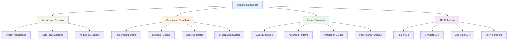
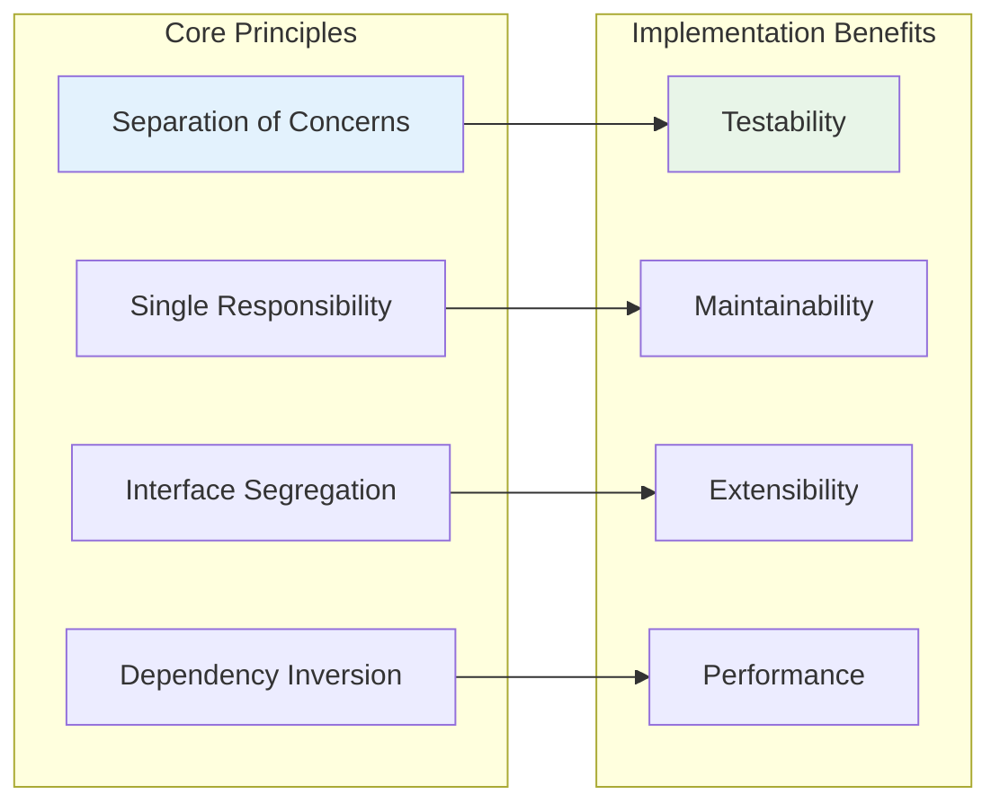
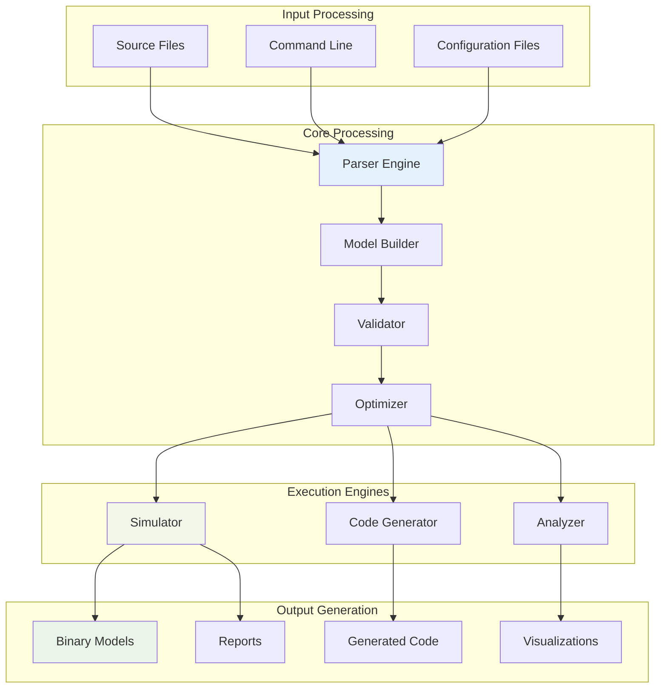
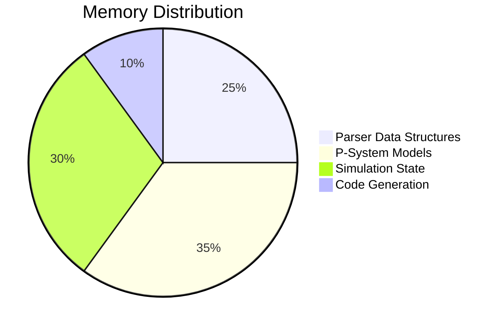
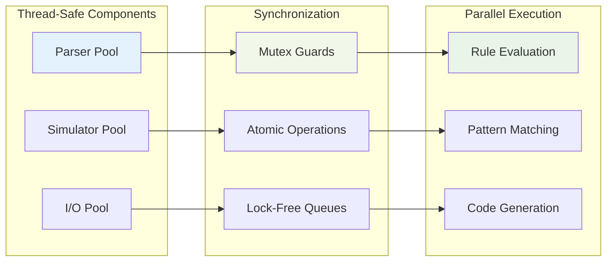
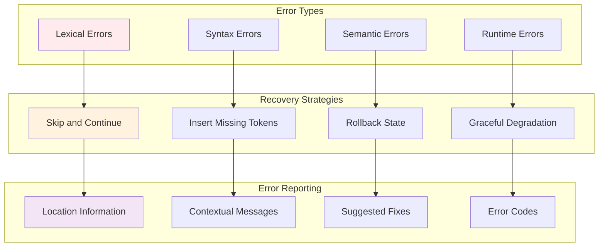
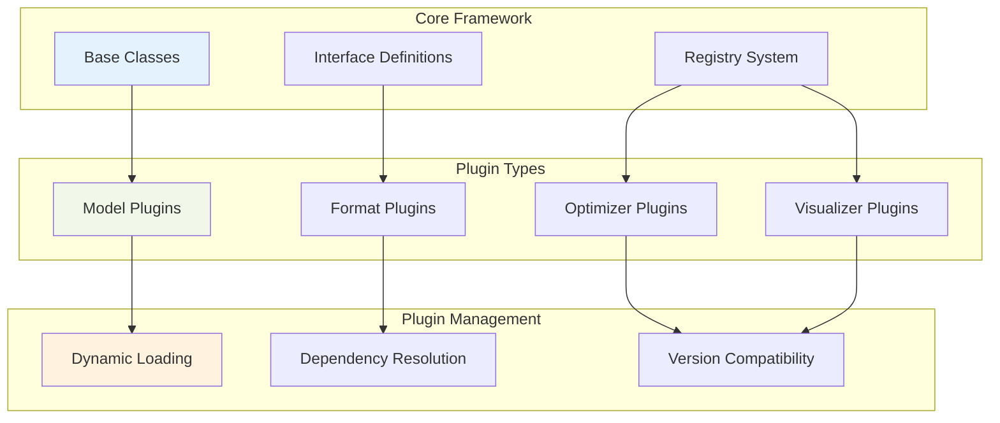

# P-Lingua Documentation Index

## Welcome to P-Lingua Architecture Documentation

This comprehensive documentation suite provides detailed insights into the P-Lingua framework for membrane computing, featuring architectural diagrams, component analysis, and practical examples.

## Documentation Structure



## Quick Navigation

### 📐 [Architecture Overview](ARCHITECTURE.md)
Comprehensive system-level view of P-Lingua's design patterns and architectural decisions.

**Key Diagrams:**
- High-level system architecture
- Core data structures
- Module interaction patterns
- Data flow and execution models
- Memory management strategies

### 🔧 [Component Deep Dive](COMPONENTS.md)
Detailed analysis of individual components and their internal architectures.

**Covered Components:**
- Parser component with lexical/semantic analysis
- Simulator engine with rule selection algorithms
- Code generator with template systems
- Serialization framework with binary formats
- Inter-component communication patterns

### 💡 [Usage Examples](EXAMPLES.md)
Practical demonstrations of P-Lingua features through working examples.

**Example Categories:**
- Basic membrane systems
- Complex division patterns
- Pattern matching with variables
- Multi-environment communication
- Error handling scenarios

## Architecture Highlights

### Modular Design Philosophy



### Key Architectural Patterns

#### 1. **Parser Pattern**
- Lexical analysis with Flex
- Syntactic analysis with Bison
- Abstract syntax tree construction
- Semantic validation pipeline

#### 2. **Simulation Engine Pattern**
- Rule-based execution model
- Configuration state management
- Conflict resolution strategies
- Performance optimization

#### 3. **Code Generation Pattern**
- Template-driven generation
- Symbol table management
- Optimization pass framework
- Target-specific backends

#### 4. **Serialization Pattern**
- Binary format efficiency
- Version compatibility
- Cross-platform support
- Incremental loading

## Component Interaction Map



## Performance Characteristics

### Computational Complexity

```mermaid
graph TD
    subgraph "Parsing Complexity"
        A[Lexical: O(n)]
        B[Syntactic: O(n³)]
        C[Semantic: O(n·m)]
    end
    
    subgraph "Simulation Complexity"
        D[Rule Selection: O(r·m)]
        E[Rule Application: O(a·c)]
        F[State Update: O(m·o)]
    end
    
    subgraph "Generation Complexity"
        G[Template Processing: O(t·s)]
        H[Optimization: O(n²)]
        I[Code Emission: O(n)]
    end
    
    A --> D
    B --> E
    C --> F
    
    D --> G
    E --> H
    F --> I
    
    style A fill:#e3f2fd
    style D fill:#f1f8e9
    style G fill:#fff3e0
```

Where:
- `n` = source code size
- `m` = number of membranes
- `r` = number of rules
- `a` = rule applications
- `c` = configuration complexity
- `o` = number of objects
- `t` = template size
- `s` = symbol count

## Memory Usage Patterns

### Memory Allocation Strategy



### Memory Management Features

- **Object Pooling**: Reduces allocation overhead
- **String Interning**: Minimizes memory duplication
- **Lazy Loading**: Defers expensive operations
- **Reference Counting**: Manages object lifetimes
- **Memory Mapping**: Efficient file I/O

## Threading and Concurrency

### Concurrency Model



## Error Handling Philosophy

### Error Categories and Recovery



## Extension Points

### Customization Opportunities

1. **Custom Models**: Define new computational models
2. **Rule Patterns**: Add domain-specific rule types
3. **Output Formats**: Support additional target languages
4. **Optimization Passes**: Implement custom optimizations
5. **Visualization**: Create custom diagram generators

### Plugin Architecture



## Getting Started

### Prerequisites
- GCC 4.9.0 or higher
- Flex and Bison
- Boost libraries (filesystem, program_options)

### Build Process
```bash
make grammar
make compiler
make simulator
sudo make install
```

### First Steps
1. Read the [Architecture Overview](ARCHITECTURE.md)
2. Explore [Component Details](COMPONENTS.md)
3. Try the [Usage Examples](EXAMPLES.md)
4. Build your first P-system model

## Contributing

This documentation is part of the living architecture of P-Lingua. Contributions, corrections, and enhancements are welcome. The diagrams use Mermaid syntax for maintainability and can be updated as the system evolves.

### Documentation Standards
- Use Mermaid diagrams for all visualizations
- Maintain consistency in color schemes
- Include practical examples with explanations
- Update diagrams when architecture changes
- Cross-reference between documentation sections

---

*This documentation represents the current state of P-Lingua's architecture and will be updated as the system evolves.*