# RR-PLingua Documentation Index

## Overview

Welcome to the **RR-PLingua** comprehensive documentation center. This documentation covers a revolutionary cognitive membrane computing platform that integrates **P-Lingua** framework, **Relevance Realization (RR)** dynamics, and **OpenCog AtomSpace** symbolic reasoning.

## 📋 Quick Navigation

| Document | Description | Key Topics |
|----------|-------------|------------|
| **[TECHNICAL_ARCHITECTURE.md](TECHNICAL_ARCHITECTURE.md)** | 🏗️ **Master Architecture Overview** | System integration, deployment, APIs, security |
| **[ARCHITECTURE.md](ARCHITECTURE.md)** | 🔧 **Core P-Lingua Architecture** | Parser, simulator, code generation, extensions |
| **[RR_ARCHITECTURE.md](RR_ARCHITECTURE.md)** | 🧠 **RR-RNN Cognitive Architecture** | Relevance realization, trialectic dynamics, AtomSpace |
| **[COMPONENTS.md](COMPONENTS.md)** | ⚙️ **Component Deep Dive** | Serialization, code generation, data structures |
| **[RR_PROCESS_FLOWS.md](RR_PROCESS_FLOWS.md)** | 🔄 **Process Flow Diagrams** | Detailed workflows, integration patterns |
| **[EXAMPLES.md](EXAMPLES.md)** | 📚 **Usage Examples** | Code samples, integration guides |
| **[RR_EXAMPLES.md](RR_EXAMPLES.md)** | 🎯 **RR-Specific Examples** | Cognitive computing scenarios |

## 🏗️ Architecture Overview Map

```mermaid
graph TB
    subgraph "📖 Documentation Hierarchy"
        TECH[🏗️ Technical Architecture<br/>TECHNICAL_ARCHITECTURE.md]
        ARCH[🔧 Core Architecture<br/>ARCHITECTURE.md]
        RR[🧠 RR Architecture<br/>RR_ARCHITECTURE.md]
        COMP[⚙️ Components<br/>COMPONENTS.md]
        FLOW[🔄 Process Flows<br/>RR_PROCESS_FLOWS.md]
        EX[📚 Examples<br/>EXAMPLES.md]
        RRE[🎯 RR Examples<br/>RR_EXAMPLES.md]
    end
    
    subgraph "🎯 Architectural Views"
        SYSTEM[System Integration]
        DATA[Data Flow]
        API[API Design]
        DEPLOY[Deployment]
        PERF[Performance]
        SEC[Security]
    end
    
    subgraph "🧠 Cognitive Components"
        PLINGUA[P-Lingua Core]
        RELEVANCE[RR Dynamics]
        ATOMSPACE[AtomSpace]
        PLN[PLN Inference]
    end
    
    subgraph "⚙️ Implementation Details"
        PARSER[Parser Engine]
        SIMULATOR[Simulator]
        GENERATOR[Code Generator]
        SERIALIZER[Serialization]
    end
    
    TECH --> SYSTEM
    TECH --> DATA
    TECH --> API
    TECH --> DEPLOY
    TECH --> PERF
    TECH --> SEC
    
    ARCH --> PLINGUA
    ARCH --> PARSER
    ARCH --> SIMULATOR
    ARCH --> GENERATOR
    
    RR --> RELEVANCE
    RR --> ATOMSPACE
    RR --> PLN
    
    COMP --> SERIALIZER
    COMP --> GENERATOR
    
    FLOW --> RELEVANCE
    FLOW --> PLN
    
    EX --> PLINGUA
    EX --> PARSER
    
    RRE --> RELEVANCE
    RRE --> ATOMSPACE
    
    style TECH fill:#e3f2fd
    style RR fill:#f3e5f5
    style COMP fill:#e8f5e8
    style FLOW fill:#fff3e0
```

## 🎯 Architecture Documentation by Viewpoint

### 🏗️ System Architecture Views
Comprehensive system-level architectural perspectives:

- **[System Integration Architecture](TECHNICAL_ARCHITECTURE.md#system-architecture-overview)** - Overall system integration and component relationships
- **[High-Level Integration](TECHNICAL_ARCHITECTURE.md#high-level-integration-architecture)** - Core processing hub and coordination patterns
- **[Component Interaction](TECHNICAL_ARCHITECTURE.md#component-interaction-architecture)** - Detailed component relationships and data flows
- **[Module Interaction](ARCHITECTURE.md#module-interaction-architecture)** - P-Lingua specific module interactions

### 🔄 Data Flow and Processing
How data flows through the integrated system:

- **[Data Flow Architecture](TECHNICAL_ARCHITECTURE.md#data-flow-architecture)** - End-to-end data processing sequences
- **[Parsing Data Flow](ARCHITECTURE.md#parsing-data-flow)** - P-Lingua parsing pipeline
- **[Simulation Execution Flow](ARCHITECTURE.md#simulation-execution-flow)** - Membrane simulation processing
- **[System Integration Flow](RR_ARCHITECTURE.md#system-integration-flow)** - RR-RNN processing pipeline

### 🌐 Interface and API Architecture
System interfaces and integration points:

- **[API Architecture](TECHNICAL_ARCHITECTURE.md#api-architecture)** - Complete API ecosystem design
- **[Scheme Interface Architecture](RR_ARCHITECTURE.md#scheme-interface-command-processing)** - Interactive REPL system
- **[Integration Architecture](ARCHITECTURE.md#integration-architecture-with-external-systems)** - External system integration patterns

### 🚀 Deployment and Operations
Production deployment and operational aspects:

- **[Deployment Architecture](TECHNICAL_ARCHITECTURE.md#deployment-architecture)** - Multi-tier deployment patterns
- **[Performance Architecture](TECHNICAL_ARCHITECTURE.md#performance-and-scalability-architecture)** - Scalability and optimization
- **[Operational Architecture](TECHNICAL_ARCHITECTURE.md#operational-architecture)** - DevOps and maintenance workflows
- **[Security Architecture](TECHNICAL_ARCHITECTURE.md#security-architecture)** - Comprehensive security framework

## 🧠 Cognitive Architecture Focus

### 🔬 Relevance Realization Framework
Core RR cognitive dynamics:

- **[RR Trialectic Dynamics](RR_ARCHITECTURE.md#rr-trialectic-dynamics-process)** - Agent-arena-relation processing
- **[Multi-Level Integration](RR_ARCHITECTURE.md#multi-level-emergence-detection)** - Hierarchical cognitive processing
- **[Emergence Detection](RR_ARCHITECTURE.md#emergence-detection-algorithm)** - Pattern recognition and adaptation
- **[RR State Machine](RR_ARCHITECTURE.md#rr-state-machine-architecture)** - Cognitive state transitions

### 🤖 Symbolic Reasoning Integration
AtomSpace and PLN integration:

- **[AtomSpace Integration](RR_ARCHITECTURE.md#atomspace-integration-architecture)** - Knowledge representation bridge
- **[PLN Inference](RR_ARCHITECTURE.md#pln-inference-process-flow)** - Probabilistic reasoning engine
- **[Persistent Storage](RR_ARCHITECTURE.md#persistent-storage-architecture)** - Knowledge persistence and learning
- **[Memory Consolidation](RR_ARCHITECTURE.md#memory-consolidation-process)** - Adaptive memory management

## ⚙️ Implementation Architecture

### 🔧 Core Components
Detailed component architecture:

- **[Core Data Structures](ARCHITECTURE.md#core-data-structures)** - Fundamental system data models
- **[Code Generation](ARCHITECTURE.md#code-generation-architecture)** - Template-based code generation
- **[Serialization Framework](COMPONENTS.md#data-serialization-architecture)** - Data persistence and exchange
- **[Error Handling](ARCHITECTURE.md#error-handling-and-diagnostics)** - Comprehensive error management

### 🏭 Processing Engines
Core processing subsystems:

- **[Parser Architecture](ARCHITECTURE.md#parsing-data-flow)** - P-Lingua language processing
- **[Simulator Engine](ARCHITECTURE.md#simulation-execution-flow)** - Membrane simulation execution
- **[Memory Management](ARCHITECTURE.md#memory-and-object-management)** - Resource optimization
- **[Extension Framework](ARCHITECTURE.md#extension-and-plugin-architecture)** - Plugin and customization system

## 🔄 Process Flows and Workflows

### 📊 System Processes
Detailed process documentation:

- **[Overall System Process](RR_PROCESS_FLOWS.md#overall-system-process-flow)** - Complete system workflow
- **[PLN Inference Process](RR_PROCESS_FLOWS.md#pln-inference-process-flow)** - Reasoning workflow
- **[Scheme Command Processing](RR_PROCESS_FLOWS.md#scheme-interface-command-processing)** - Interactive command handling
- **[Integration Test Flow](RR_PROCESS_FLOWS.md#integration-test-flow)** - Comprehensive testing workflow

### 🔄 Cognitive Processes
RR-specific cognitive workflows:

- **[Trialectic Dynamics](RR_PROCESS_FLOWS.md#rr-trialectic-dynamics-process)** - Core cognitive processing
- **[Multi-Level Emergence](RR_PROCESS_FLOWS.md#multi-level-emergence-detection)** - Hierarchical pattern detection
- **[Persistent Storage Process](RR_PROCESS_FLOWS.md#persistent-storage-process-flow)** - Knowledge persistence workflow

## 📚 Implementation Examples and Usage

### 🎯 Basic Usage Examples
Getting started with the system:

- **[Basic Examples](EXAMPLES.md#basic-examples)** - Simple usage patterns
- **[Advanced Patterns](EXAMPLES.md#advanced-patterns)** - Complex integration scenarios
- **[Integration Guides](EXAMPLES.md#integration-guides)** - Step-by-step integration
- **[Performance Analysis](EXAMPLES.md#performance-analysis)** - Optimization examples

### 🧠 RR-Specific Examples
Cognitive computing applications:

- **[RR-Enhanced Examples](RR_EXAMPLES.md#rr-enhanced-examples)** - Cognitive computing scenarios
- **[Scheme Interface Examples](RR_EXAMPLES.md#scheme-interface-examples)** - Interactive exploration
- **[PLN Integration Examples](RR_EXAMPLES.md#pln-integration-examples)** - Reasoning applications
- **[Multi-Level Examples](RR_EXAMPLES.md#multi-level-examples)** - Hierarchical processing

## 🛠️ Extension and Customization

### 🔌 Plugin Architecture
System extensibility:

- **[Extension Points](ARCHITECTURE.md#extension-and-plugin-architecture)** - Customization interfaces
- **[Plugin Development](COMPONENTS.md#code-generator-architecture)** - Creating custom components
- **[Custom Models](EXAMPLES.md#advanced-patterns)** - Developing domain-specific models
- **[Integration Patterns](EXAMPLES.md#integration-guides)** - External system integration

### 🎨 Design Patterns
Architectural patterns and best practices:

- **[Design Patterns](TECHNICAL_ARCHITECTURE.md#architecture-principles-and-design-patterns)** - Core architectural patterns
- **[RR Design Patterns](RR_ARCHITECTURE.md#rr-specific-design-patterns)** - Cognitive-specific patterns
- **[Code Templates](COMPONENTS.md#code-templates-and-patterns)** - Reusable code patterns
- **[Integration Patterns](RR_ARCHITECTURE.md#advanced-rr-integration-patterns)** - Advanced integration strategies

## 🔍 Architecture Highlights

### 🌟 Key Innovations
Revolutionary architectural features:

1. **🔗 Unified Cognitive Computing**: Seamless integration of symbolic and subsymbolic processing
2. **🧠 Trialectic Dynamics**: Agent-arena-relation cognitive framework implementation
3. **⚡ Multi-Level Processing**: Hierarchical emergence detection and cross-level coordination
4. **💾 Persistent Learning**: Continuous knowledge accumulation and memory consolidation
5. **🎛️ Interactive Exploration**: Real-time system manipulation through Scheme REPL
6. **🏗️ Production Architecture**: Enterprise-ready deployment and operational capabilities

### 🎯 Architectural Strengths
Core system advantages:

- **Modularity**: Clean separation between P-Lingua, RR, and AtomSpace components
- **Extensibility**: Comprehensive plugin architecture for customization
- **Performance**: Optimized algorithms and data structures for cognitive computing
- **Reliability**: Robust error handling and recovery mechanisms
- **Scalability**: Horizontal and vertical scaling capabilities
- **Maintainability**: Well-documented, clean architecture with clear interfaces

## 📊 Performance Characteristics

### ⚡ Computational Complexity
System performance analysis:

- **[Performance Architecture](TECHNICAL_ARCHITECTURE.md#performance-and-scalability-architecture)** - Scaling strategies
- **[Computational Complexity](RR_ARCHITECTURE.md#performance-characteristics)** - Algorithm analysis
- **[Memory Management](ARCHITECTURE.md#memory-and-object-management)** - Resource optimization
- **[Concurrency Architecture](ARCHITECTURE.md#concurrency-and-threading-architecture)** - Parallel processing

### 📈 Scalability Features
System scaling capabilities:

- **Horizontal Scaling**: Multi-instance deployment with load balancing
- **Vertical Scaling**: Resource optimization and GPU acceleration
- **Data Scaling**: Partitioning, sharding, and replication strategies
- **Performance Monitoring**: Comprehensive metrics and alerting

## 🛡️ Security and Reliability

### 🔒 Security Framework
Comprehensive security architecture:

- **[Security Architecture](TECHNICAL_ARCHITECTURE.md#security-architecture)** - Complete security framework
- **[Error Handling](ARCHITECTURE.md#error-handling-and-diagnostics)** - Robust error management
- **[RR Error Management](RR_ARCHITECTURE.md#error-handling-and-recovery-architecture)** - Cognitive-specific error handling

### 🔄 Operational Excellence
Production operations:

- **[Monitoring Architecture](ARCHITECTURE.md#logging-and-monitoring-architecture)** - Observability framework
- **[Testing Architecture](ARCHITECTURE.md#testing-architecture)** - Comprehensive testing strategy
- **[Configuration Management](ARCHITECTURE.md#configuration-and-setup-architecture)** - Flexible configuration

## 🚀 Getting Started

### 📋 Documentation Reading Path

**For Researchers**: Start with [RR_ARCHITECTURE.md](RR_ARCHITECTURE.md) → [RR_EXAMPLES.md](RR_EXAMPLES.md) → [RR_PROCESS_FLOWS.md](RR_PROCESS_FLOWS.md)

**For Developers**: Begin with [TECHNICAL_ARCHITECTURE.md](TECHNICAL_ARCHITECTURE.md) → [ARCHITECTURE.md](ARCHITECTURE.md) → [COMPONENTS.md](COMPONENTS.md)

**For Operators**: Focus on [TECHNICAL_ARCHITECTURE.md](TECHNICAL_ARCHITECTURE.md) deployment sections → [EXAMPLES.md](EXAMPLES.md) integration guides

**For Integrators**: Study [TECHNICAL_ARCHITECTURE.md](TECHNICAL_ARCHITECTURE.md) API sections → [EXAMPLES.md](EXAMPLES.md) → [COMPONENTS.md](COMPONENTS.md)

### 🎯 Quick Start Guide

1. **Understanding the System**: Read [TECHNICAL_ARCHITECTURE.md](TECHNICAL_ARCHITECTURE.md) for comprehensive overview
2. **Core Concepts**: Study [RR_ARCHITECTURE.md](RR_ARCHITECTURE.md) for cognitive framework details
3. **Implementation Details**: Explore [ARCHITECTURE.md](ARCHITECTURE.md) and [COMPONENTS.md](COMPONENTS.md)
4. **Practical Usage**: Follow examples in [EXAMPLES.md](EXAMPLES.md) and [RR_EXAMPLES.md](RR_EXAMPLES.md)
5. **Process Understanding**: Review workflows in [RR_PROCESS_FLOWS.md](RR_PROCESS_FLOWS.md)

## 🌟 Conclusion

The RRR-P-Systems represents a breakthrough in cognitive membrane computing architecture. This comprehensive documentation provides multiple perspectives on the system, from high-level architectural views to detailed implementation specifics.

**Key Features**:
- **Revolutionary Integration**: P-Lingua + RR + AtomSpace unified platform
- **Production Ready**: Enterprise-grade architecture with full operational support
- **Research Friendly**: Comprehensive APIs and interactive exploration capabilities
- **Highly Extensible**: Plugin architecture supporting diverse applications
- **Well Documented**: Multiple architectural viewpoints with detailed examples

The documentation is designed to serve researchers, developers, operators, and integrators, providing the depth and breadth needed to understand, extend, and operate this sophisticated cognitive computing platform.