# RR-RNN Architecture Documentation

## Overview

The **RR-RNN (Relevance Realization with Recursive Neural Networks)** enhancement transforms traditional P-Lingua membrane computing into a sophisticated cognitive architecture platform by integrating:

1. **Relevance Realization (RR) Dynamics** - Dynamic self-organization through agent-arena-relation triads
2. **OpenCog AtomSpace Integration** - Symbolic knowledge representation and reasoning
3. **PLN (Probabilistic Logic Networks)** - Inference over uncertain knowledge
4. **Interactive Scheme Interface** - Real-time system exploration and manipulation

## Core RR Architecture

### Trialectic Co-Constitution Framework

```mermaid
graph TD
    subgraph "Trialectic Dynamics"
        A[Agent] --> |co-construction| B[Arena]
        B --> |co-construction| C[Relation]
        C --> |co-construction| A
    end
    
    subgraph "RR Properties"
        D[Salience]
        E[Affordance Potential]
        F[Affordance Realization]
        G[Trialectic State Vector]
    end
    
    subgraph "Mathematical Foundation"
        H[∀^ω(x ⇔^α y ⇔^α z ⇔^α x)]
        I[∇ℜ = lim_{t→∞} Σᵢ log(aᵣᵢ(t)/aₚᵢ(t))]
        J[agent ↔^δ arena ∈ ℝ^(∞×∞)]
    end
    
    A --> D
    B --> E
    C --> F
    A --> G
    
    D --> H
    E --> I
    F --> J
    
    style A fill:#e3f2fd
    style B fill:#f3e5f5
    style C fill:#e8f5e8
    style H fill:#fff3e0
```

### RR Hypergraph Structure

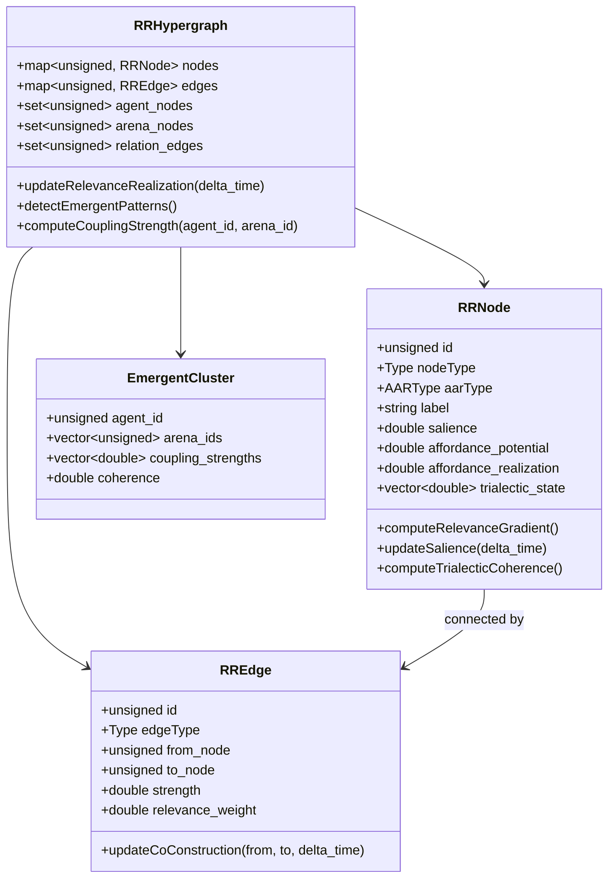

## AtomSpace Integration Architecture

### RR-AtomSpace Bridge

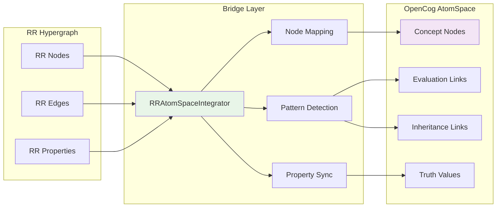

### Atom Structure Mapping

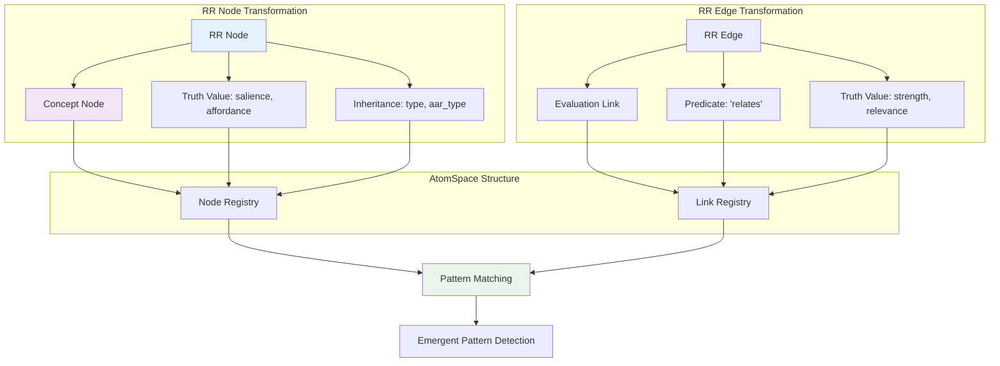

## PLN Integration Architecture

### PLN Truth Value System

```mermaid
graph TB
    subgraph "PLN Truth Values"
        A[Strength Component]
        B[Confidence Component]
        C[PLNTruthValue = (s, c)]
    end
    
    subgraph "PLN Operations"
        D[Negation: NOT(A) = (1-s, c)]
        E[Conjunction: AND(A,B) = (s_A * s_B, min(c_A, c_B))]
        F[Disjunction: OR(A,B) = (s_A + s_B - s_A*s_B, min(c_A, c_B))]
        G[Implication: A→B = (1-s_A+s_A*s_B, f(c_A,c_B))]
    end
    
    subgraph "Inference Rules"
        H[Deduction: A→B, A ⊢ B]
        I[Abduction: A→B, B ⊢ A]
        J[RR Pattern Implications]
    end
    
    A --> C
    B --> C
    C --> D
    C --> E
    C --> F
    C --> G
    
    D --> H
    E --> I
    F --> J
    G --> J
    
    style C fill:#e3f2fd
    style H fill:#f3e5f5
    style J fill:#e8f5e8
```

### PLN Inference Cycle

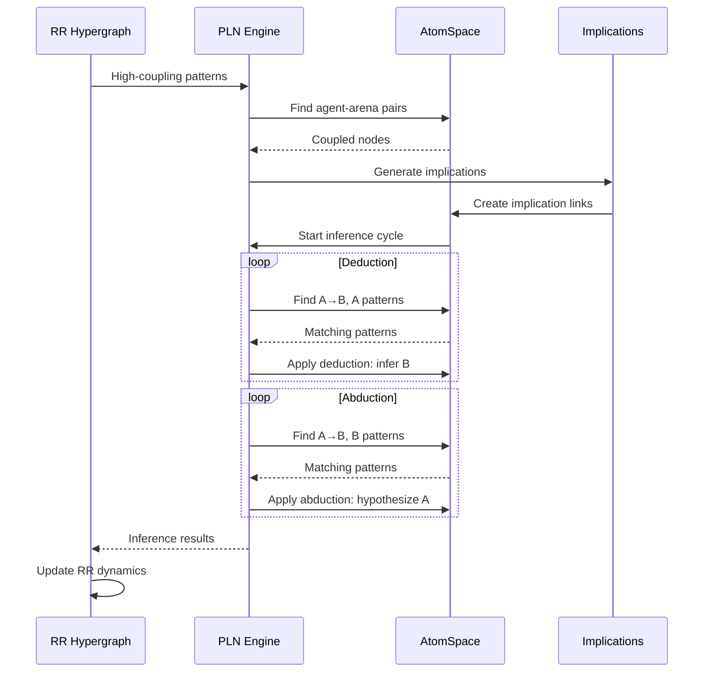

## Scheme Interface Architecture

### REPL Command Processing

```mermaid
graph TD
    subgraph "User Interface"
        A[User Input]
        B[Command Parser]
        C[Expression Evaluator]
    end
    
    subgraph "Command Types"
        D[(list-rr-nodes)]
        E[(list-atoms)]
        F[(get-system-relevance)]
        G[(run-pln-inference)]
        H[(find-patterns)]
        I[(get-salience node-ID)]
        J[(update-salience node-ID VALUE)]
        K[(find-atom "NAME")]
    end
    
    subgraph "System Access"
        L[RR Hypergraph Access]
        M[AtomSpace Access]
        N[PLN Engine Access]
        O[Pattern Matcher]
    end
    
    A --> B
    B --> C
    C --> D
    C --> E
    C --> F
    C --> G
    C --> H
    C --> I
    C --> J
    C --> K
    
    D --> L
    E --> M
    F --> L
    G --> N
    H --> O
    I --> L
    J --> L
    K --> M
    
    style C fill:#e8f5e8
    style L fill:#f3e5f5
```

### Interactive Command Flow

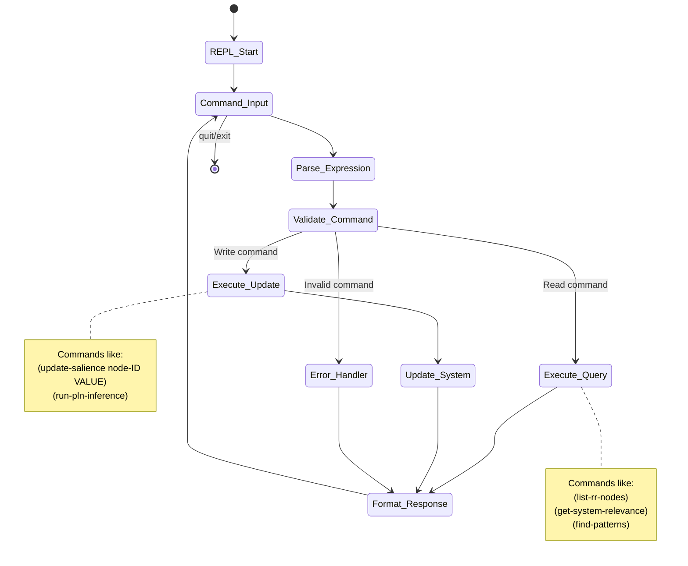

## Persistent Storage Architecture

### Serialization Framework

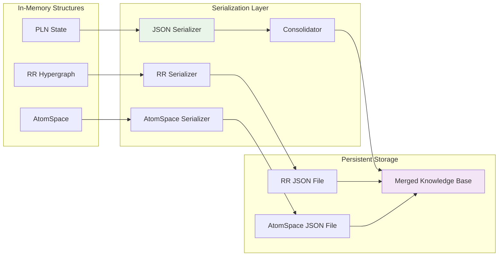

### Memory Consolidation Process

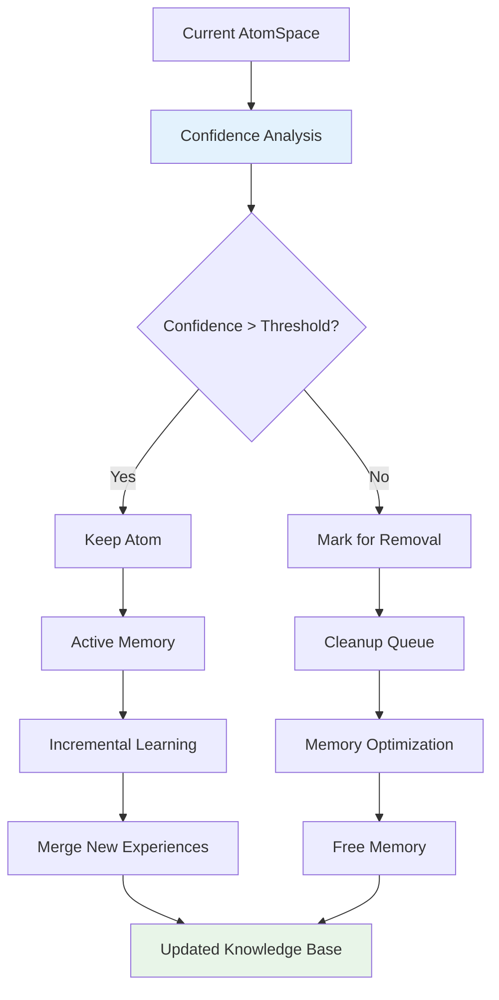

## Multi-Level Integration Architecture

### Hierarchical Membrane Structure

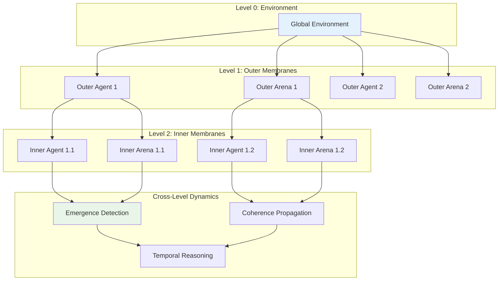

### Emergence Detection Algorithm

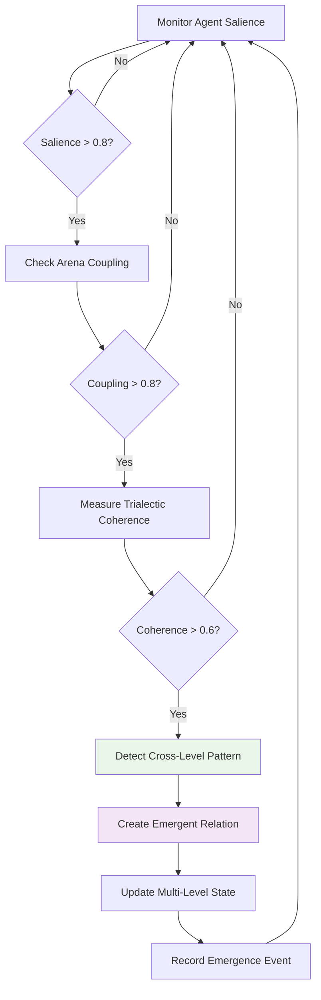

## System Integration Flow

### Complete RR-RNN Processing Pipeline

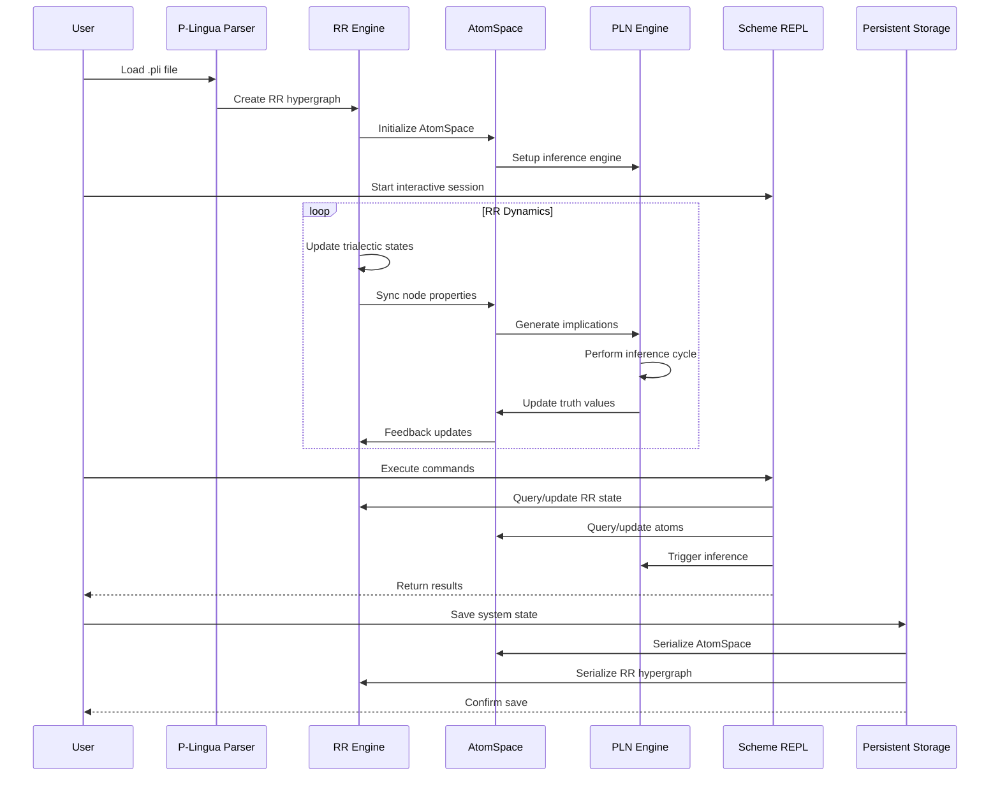

## Performance Characteristics

### Computational Complexity Analysis

```mermaid
graph LR
    subgraph "RR Operations"
        A[Node Update: O(n)]
        B[Edge Update: O(e)]
        C[Emergence Detection: O(n²)]
        D[Trialectic Dynamics: O(n)]
    end
    
    subgraph "AtomSpace Operations"
        E[Node Sync: O(n)]
        F[Pattern Matching: O(a log a)]
        G[Truth Value Update: O(a)]
        H[Link Creation: O(l)]
    end
    
    subgraph "PLN Operations"
        I[Deduction: O(r·a)]
        J[Abduction: O(r·a)]
        K[Implication Generation: O(n²)]
        L[Inference Cycle: O(r·a·c)]
    end
    
    subgraph "Overall Complexity"
        M[Per Step: O(n² + r·a·c)]
        N[Memory: O(n + a + r)]
        O[Storage: O(n + a)]
    end
    
    A --> M
    E --> M
    I --> M
    
    A --> N
    E --> N
    
    E --> O
    A --> O
    
    style M fill:#ffebee
    style N fill:#f3e5f5
    style O fill:#e8f5e8
```

Where:
- `n` = number of RR nodes
- `e` = number of RR edges  
- `a` = number of atoms
- `r` = number of inference rules
- `l` = number of links
- `c` = inference cycles

## RR-Specific Design Patterns

### Trialectic Pattern Implementation

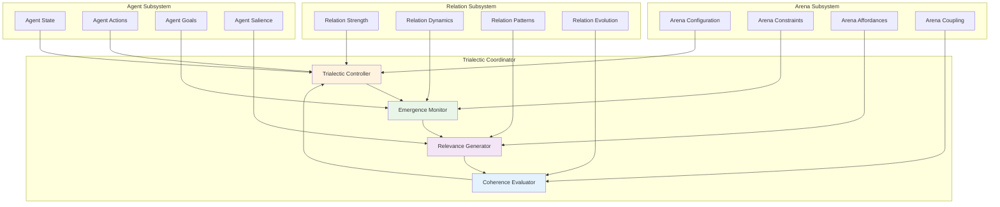

### RR State Machine Architecture

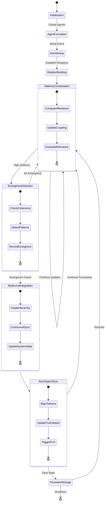

## Advanced RR Integration Patterns

### Cognitive Architecture Integration

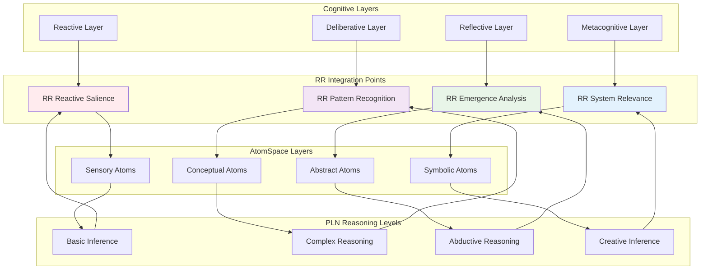

### Membrane-RR Coupling Architecture

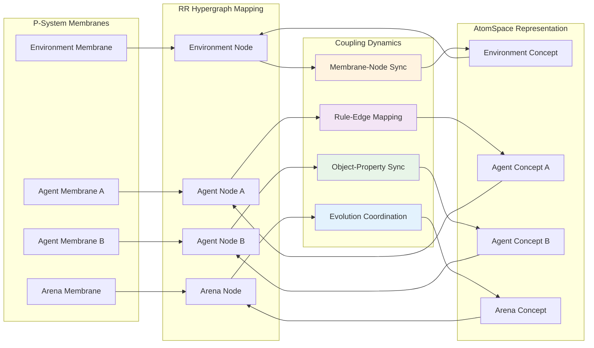

## RR Performance Optimization Architecture

### Computational Optimization Pipeline

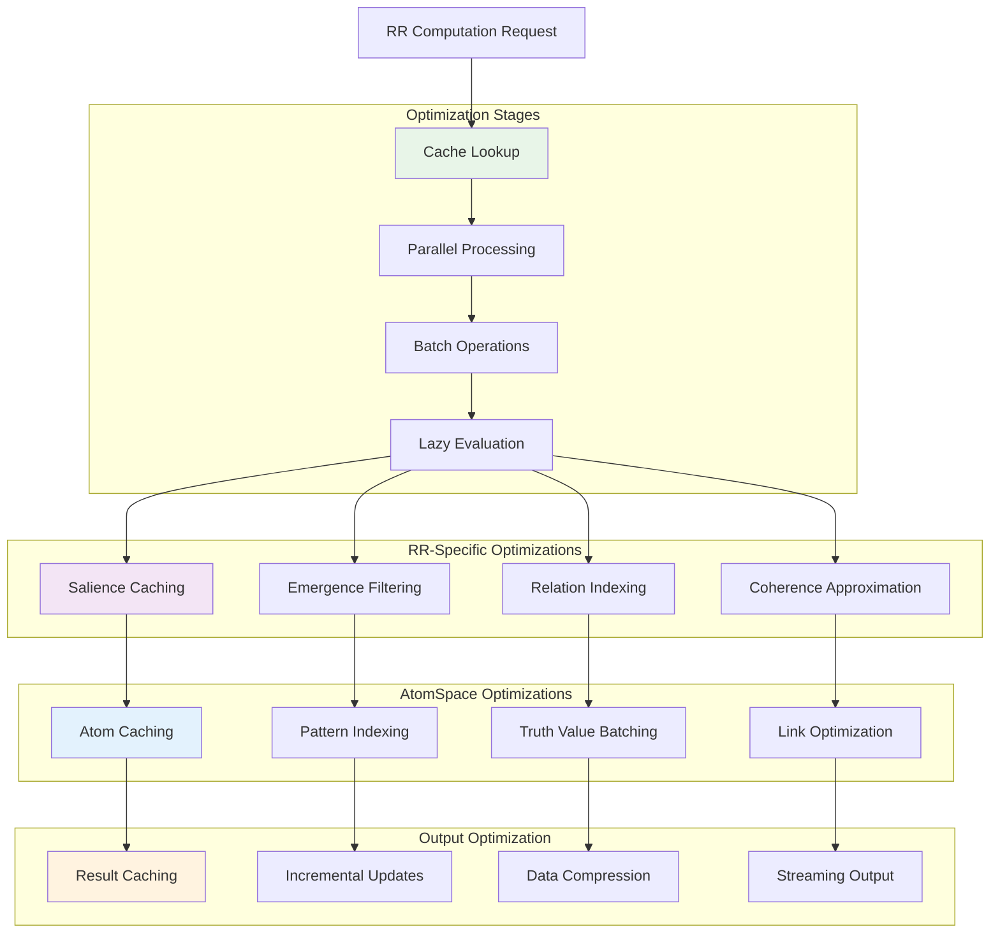

## Error Handling and Recovery Architecture

### RR-Specific Error Management

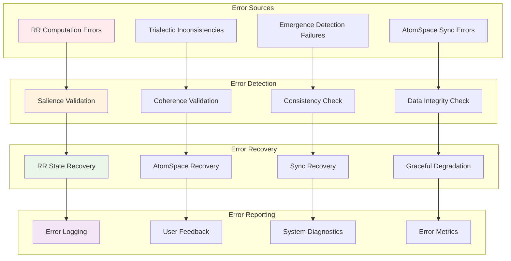

## Advanced Use Case Architectures

### Research Platform Architecture

```mermaid
graph TD
    subgraph "Research Interface"
        NOTEBOOK[Jupyter Notebooks]
        EXPERIMENT[Experiment Manager]
        ANALYSIS[Analysis Tools]
        VISUALIZATION[Visualization Dashboard]
    end
    
    subgraph "Research Services"
        PARAM_SWEEP[Parameter Sweeping]
        HYPOTHESIS_TEST[Hypothesis Testing]
        DATA_COLLECTION[Data Collection]
        RESULT_ANALYSIS[Result Analysis]
    end
    
    subgraph "RR Research Components"
        RR_EXPERIMENTS[RR Experiments]
        EMERGENCE_STUDIES[Emergence Studies]
        TRIALECTIC_ANALYSIS[Trialectic Analysis]
        COGNITIVE_MODELING[Cognitive Modeling]
    end
    
    subgraph "Data Management"
        DATASET_STORE[Dataset Storage]
        RESULT_STORE[Result Storage]
        METADATA_MGR[Metadata Manager]
        VERSION_CTRL[Version Control]
    end
    
    NOTEBOOK --> EXPERIMENT
    EXPERIMENT --> ANALYSIS
    ANALYSIS --> VISUALIZATION
    
    EXPERIMENT --> PARAM_SWEEP
    EXPERIMENT --> HYPOTHESIS_TEST
    EXPERIMENT --> DATA_COLLECTION
    EXPERIMENT --> RESULT_ANALYSIS
    
    PARAM_SWEEP --> RR_EXPERIMENTS
    HYPOTHESIS_TEST --> EMERGENCE_STUDIES
    DATA_COLLECTION --> TRIALECTIC_ANALYSIS
    RESULT_ANALYSIS --> COGNITIVE_MODELING
    
    RR_EXPERIMENTS --> DATASET_STORE
    EMERGENCE_STUDIES --> RESULT_STORE
    TRIALECTIC_ANALYSIS --> METADATA_MGR
    COGNITIVE_MODELING --> VERSION_CTRL
    
    style EXPERIMENT fill:#e3f2fd
    style RR_EXPERIMENTS fill:#f3e5f5
    style DATASET_STORE fill:#e8f5e8
```

### Production Deployment Architecture

```mermaid
graph LR
    subgraph "Load Balancing"
        LB[Load Balancer]
        HEALTH[Health Checks]
        ROUTING[Request Routing]
    end
    
    subgraph "Application Cluster"
        APP1[RR-P Instance 1]
        APP2[RR-P Instance 2]
        APP3[RR-P Instance N]
    end
    
    subgraph "Shared Services"
        REDIS[Redis Cache]
        MESSAGE_QUEUE[Message Queue]
        FILE_STORAGE[File Storage]
        CONFIG_SVC[Config Service]
    end
    
    subgraph "Data Persistence"
        ATOMSPACE_DB[AtomSpace Database]
        RR_STORE[RR Hypergraph Store]
        BACKUP_SVC[Backup Service]
        REPLICATION[Data Replication]
    end
    
    subgraph "Monitoring & Ops"
        PROMETHEUS[Prometheus]
        GRAFANA[Grafana Dashboards]
        ALERTMANAGER[Alert Manager]
        LOG_AGGREGATOR[Log Aggregation]
    end
    
    LB --> HEALTH
    HEALTH --> ROUTING
    ROUTING --> APP1
    ROUTING --> APP2
    ROUTING --> APP3
    
    APP1 --> REDIS
    APP2 --> MESSAGE_QUEUE
    APP3 --> FILE_STORAGE
    APP1 --> CONFIG_SVC
    
    APP1 --> ATOMSPACE_DB
    APP2 --> RR_STORE
    APP3 --> BACKUP_SVC
    ATOMSPACE_DB --> REPLICATION
    
    APP1 --> PROMETHEUS
    APP2 --> GRAFANA
    APP3 --> ALERTMANAGER
    PROMETHEUS --> LOG_AGGREGATOR
    
    style LB fill:#e3f2fd
    style APP1 fill:#f3e5f5
    style REDIS fill:#e8f5e8
    style ATOMSPACE_DB fill:#fff3e0
    style PROMETHEUS fill:#ffebee
```

## Conclusion

This comprehensive RR-RNN architecture documentation provides detailed insights into how Relevance Realization enhances traditional membrane computing with cognitive capabilities. The architecture demonstrates sophisticated integration patterns between:

### Key Architectural Innovations

**Trialectic Integration**: Seamless coupling between agent-arena-relation dynamics and symbolic reasoning, creating a unified cognitive computing platform.

**Multi-Level Processing**: Hierarchical emergence detection across system levels, enabling complex pattern recognition and adaptive behavior.

**Persistent Learning**: Knowledge accumulation through AtomSpace serialization and memory consolidation, supporting continuous system evolution.

**Interactive Exploration**: Real-time system manipulation through Scheme REPL interface, enabling researchers to explore cognitive dynamics interactively.

### Production-Ready Features

**Scalability**: Horizontal and vertical scaling capabilities with optimized performance characteristics for large-scale cognitive computing workloads.

**Reliability**: Comprehensive error handling, recovery mechanisms, and graceful degradation ensuring robust operation in production environments.

**Observability**: Full monitoring, logging, and diagnostics capabilities providing complete system visibility for operations and research.

**Extensibility**: Plugin architecture and API framework supporting custom cognitive models, reasoning patterns, and integration with external systems.

The RR-RNN architecture represents a significant advancement in cognitive membrane computing, providing a sophisticated platform for research in artificial intelligence, complex systems modeling, and cognitive architectures. The comprehensive technical documentation ensures the system can be understood, extended, and operated effectively by researchers and engineers working with advanced cognitive computing systems.