# RR-RNN Architecture Documentation

## Overview

The **RR-RNN (Relevance Realization with Recursive Neural Networks)** enhancement transforms traditional P-Lingua membrane computing into a sophisticated cognitive architecture platform by integrating:

1. **Relevance Realization (RR) Dynamics** - Dynamic self-organization through agent-arena-relation triads
2. **OpenCog AtomSpace Integration** - Symbolic knowledge representation and reasoning
3. **PLN (Probabilistic Logic Networks)** - Inference over uncertain knowledge
4. **Interactive Scheme Interface** - Real-time system exploration and manipulation

## Core RR Architecture

### Trialectic Co-Constitution Framework

```mermaid
graph TD
    subgraph "Trialectic Dynamics"
        A[Agent] --> |co-construction| B[Arena]
        B --> |co-construction| C[Relation]
        C --> |co-construction| A
    end
    
    subgraph "RR Properties"
        D[Salience]
        E[Affordance Potential]
        F[Affordance Realization]
        G[Trialectic State Vector]
    end
    
    subgraph "Mathematical Foundation"
        H[∀^ω(x ⇔^α y ⇔^α z ⇔^α x)]
        I[∇ℜ = lim_{t→∞} Σᵢ log(aᵣᵢ(t)/aₚᵢ(t))]
        J[agent ↔^δ arena ∈ ℝ^(∞×∞)]
    end
    
    A --> D
    B --> E
    C --> F
    A --> G
    
    D --> H
    E --> I
    F --> J
    
    style A fill:#e3f2fd
    style B fill:#f3e5f5
    style C fill:#e8f5e8
    style H fill:#fff3e0
```

### RR Hypergraph Structure


## AtomSpace Integration Architecture

### RR-AtomSpace Bridge


### Atom Structure Mapping


## PLN Integration Architecture

### PLN Truth Value System

```mermaid
graph TB
    subgraph "PLN Truth Values"
        A[Strength Component]
        B[Confidence Component]
        C[PLNTruthValue = (s, c)]
    end
    
    subgraph "PLN Operations"
        D[Negation: NOT(A) = (1-s, c)]
        E[Conjunction: AND(A,B) = (s_A * s_B, min(c_A, c_B))]
        F[Disjunction: OR(A,B) = (s_A + s_B - s_A*s_B, min(c_A, c_B))]
        G[Implication: A→B = (1-s_A+s_A*s_B, f(c_A,c_B))]
    end
    
    subgraph "Inference Rules"
        H[Deduction: A→B, A ⊢ B]
        I[Abduction: A→B, B ⊢ A]
        J[RR Pattern Implications]
    end
    
    A --> C
    B --> C
    C --> D
    C --> E
    C --> F
    C --> G
    
    D --> H
    E --> I
    F --> J
    G --> J
    
    style C fill:#e3f2fd
    style H fill:#f3e5f5
    style J fill:#e8f5e8
```

### PLN Inference Cycle


## Scheme Interface Architecture

### REPL Command Processing

```mermaid
graph TD
    subgraph "User Interface"
        A[User Input]
        B[Command Parser]
        C[Expression Evaluator]
    end
    
    subgraph "Command Types"
        D[(list-rr-nodes)]
        E[(list-atoms)]
        F[(get-system-relevance)]
        G[(run-pln-inference)]
        H[(find-patterns)]
        I[(get-salience node-ID)]
        J[(update-salience node-ID VALUE)]
        K[(find-atom "NAME")]
    end
    
    subgraph "System Access"
        L[RR Hypergraph Access]
        M[AtomSpace Access]
        N[PLN Engine Access]
        O[Pattern Matcher]
    end
    
    A --> B
    B --> C
    C --> D
    C --> E
    C --> F
    C --> G
    C --> H
    C --> I
    C --> J
    C --> K
    
    D --> L
    E --> M
    F --> L
    G --> N
    H --> O
    I --> L
    J --> L
    K --> M
    
    style C fill:#e8f5e8
    style L fill:#f3e5f5
```

### Interactive Command Flow


## Persistent Storage Architecture

### Serialization Framework


### Memory Consolidation Process


## Multi-Level Integration Architecture

### Hierarchical Membrane Structure


### Emergence Detection Algorithm


## System Integration Flow

### Complete RR-RNN Processing Pipeline

```mermaid
sequenceDiagram
    participant User
    participant Parser as P-Lingua Parser
    participant RR as RR Engine
    participant AS as AtomSpace
    participant PLN as PLN Engine
    participant Scheme as Scheme REPL
    participant Storage as Persistent Storage
    
    User->>Parser: Load .pli file
    Parser->>RR: Create RR hypergraph
    RR->>AS: Initialize AtomSpace
    AS->>PLN: Setup inference engine
    
    User->>Scheme: Start interactive session
    
    loop RR Dynamics
        RR->>RR: Update trialectic states
        RR->>AS: Sync node properties
        AS->>PLN: Generate implications
        PLN->>PLN: Perform inference cycle
        PLN->>AS: Update truth values
        AS->>RR: Feedback updates
    end
    
    User->>Scheme: Execute commands
    Scheme->>RR: Query/update RR state
    Scheme->>AS: Query/update atoms
    Scheme->>PLN: Trigger inference
    Scheme-->>User: Return results
    
    User->>Storage: Save system state
    Storage->>AS: Serialize AtomSpace
    Storage->>RR: Serialize RR hypergraph
    Storage-->>User: Confirm save
```



## Performance Characteristics

### Computational Complexity Analysis

```mermaid
graph LR
    subgraph "RR Operations"
        A[Node Update: O(n)]
        B[Edge Update: O(e)]
        C[Emergence Detection: O(n²)]
        D[Trialectic Dynamics: O(n)]
    end
    
    subgraph "AtomSpace Operations"
        E[Node Sync: O(n)]
        F[Pattern Matching: O(a log a)]
        G[Truth Value Update: O(a)]
        H[Link Creation: O(l)]
    end
    
    subgraph "PLN Operations"
        I[Deduction: O(r·a)]
        J[Abduction: O(r·a)]
        K[Implication Generation: O(n²)]
        L[Inference Cycle: O(r·a·c)]
    end
    
    subgraph "Overall Complexity"
        M[Per Step: O(n² + r·a·c)]
        N[Memory: O(n + a + r)]
        O[Storage: O(n + a)]
    end
    
    A --> M
    E --> M
    I --> M
    
    A --> N
    E --> N
    
    E --> O
    A --> O
    
    style M fill:#ffebee
    style N fill:#f3e5f5
    style O fill:#e8f5e8
```

Where:
- `n` = number of RR nodes
- `e` = number of RR edges  
- `a` = number of atoms
- `r` = number of inference rules
- `l` = number of links
- `c` = inference cycles

This architecture documentation provides a comprehensive view of how RR-RNN enhances traditional membrane computing with cognitive capabilities, creating a sophisticated platform for symbolic-subsymbolic integration and emergent pattern recognition.