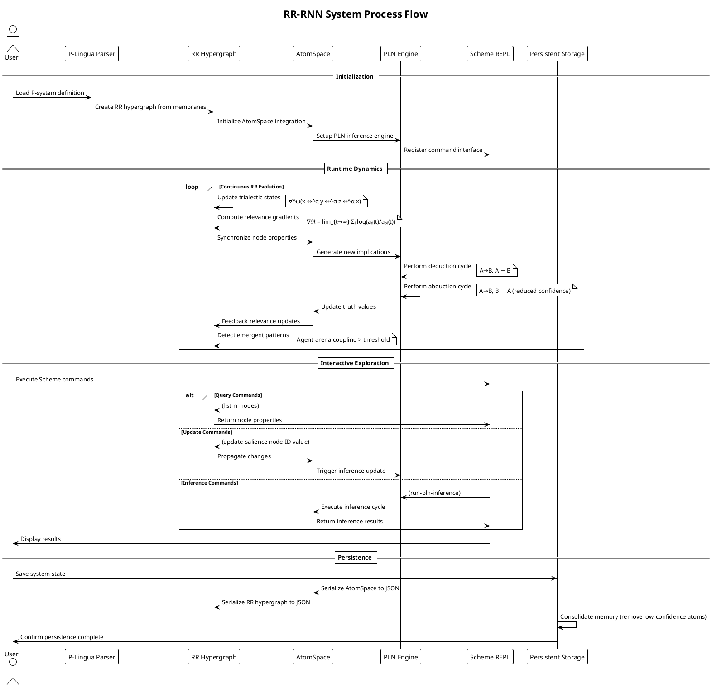
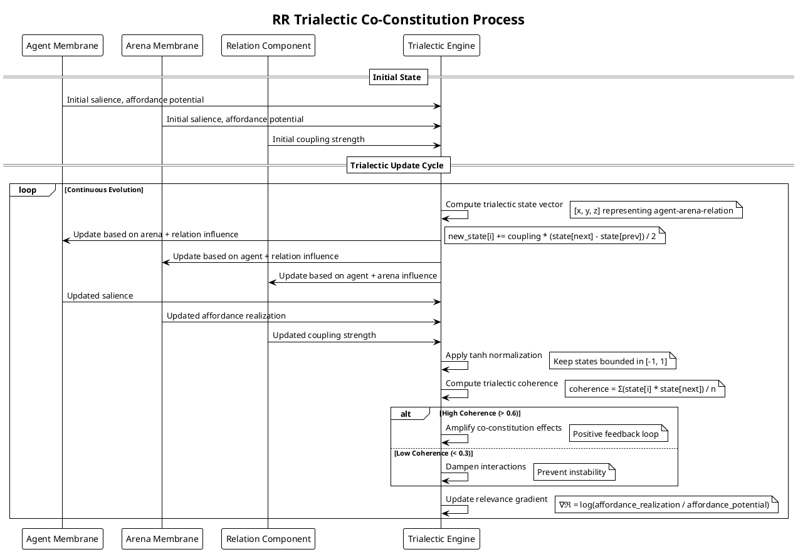
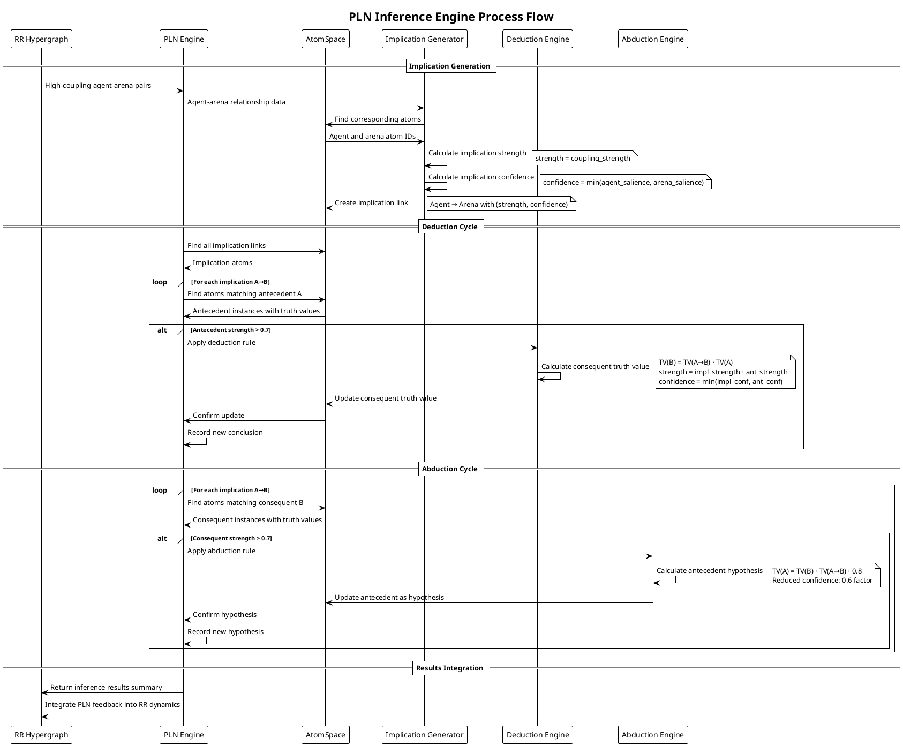
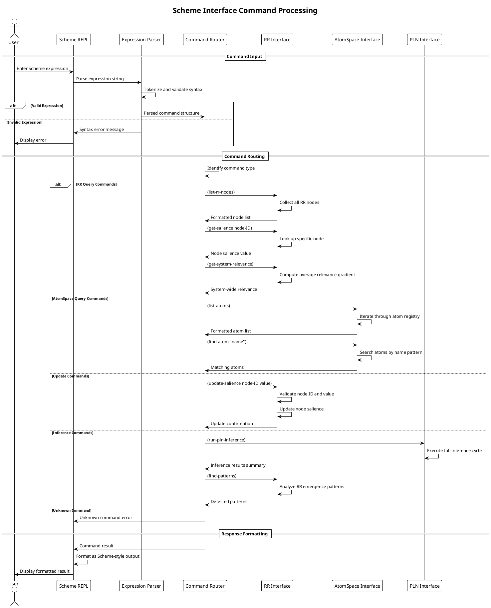
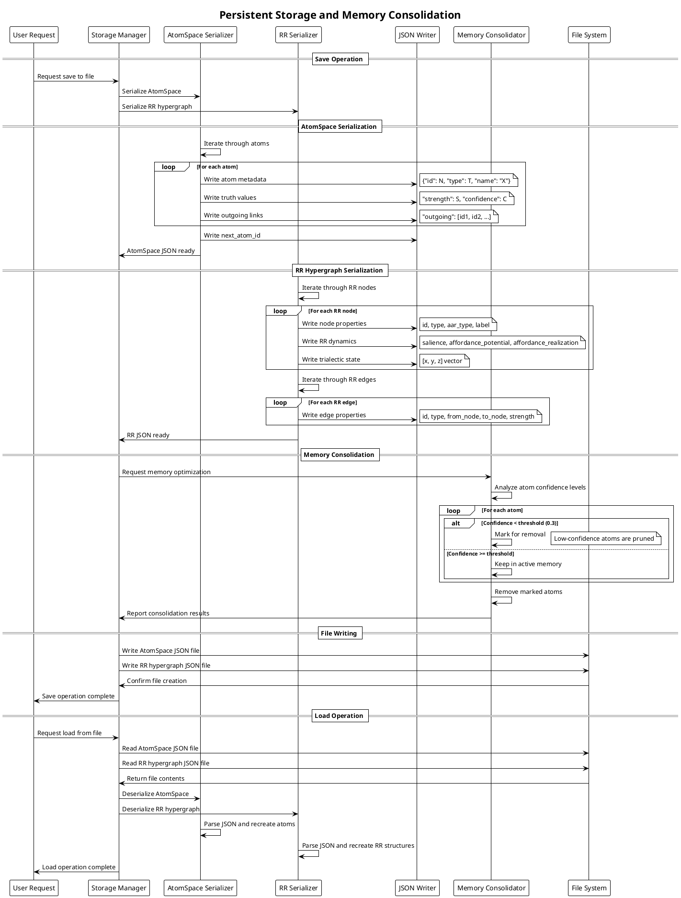
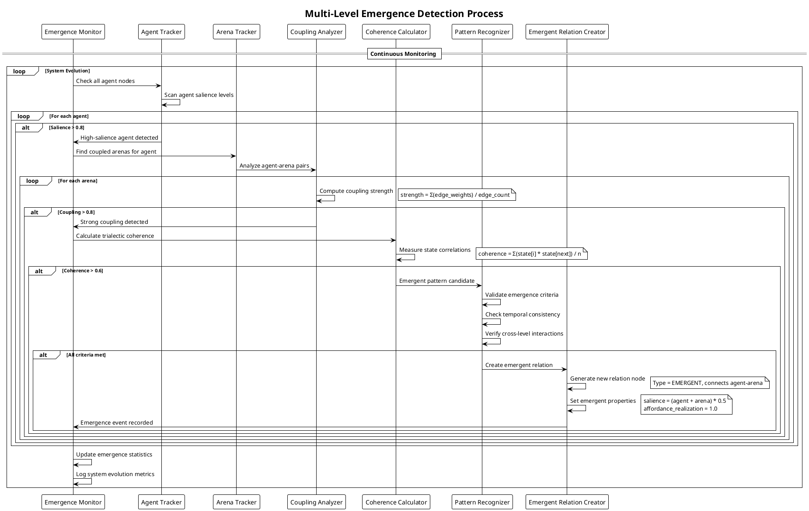
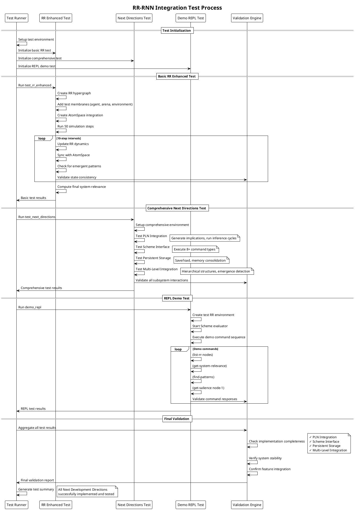

# RR-RNN Process Flow Diagrams

This document contains PlantUML diagrams showing the detailed process flows of the RR-RNN system components.

## Overall System Process Flow

## RR Trialectic Dynamics Process

## PLN Inference Process Flow

## Scheme Interface Command Processing

## Persistent Storage Process Flow

## Multi-Level Emergence Detection

## Integration Test Flow

These PlantUML diagrams provide detailed process flows for all major components of the RR-RNN system, showing the intricate interactions between relevance realization dynamics, symbolic reasoning, and cognitive architecture integration.