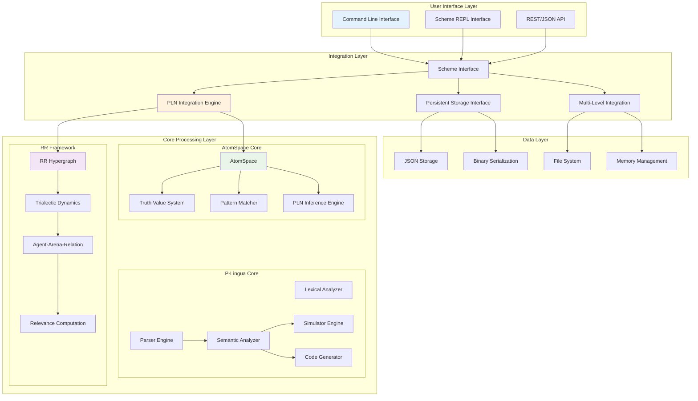
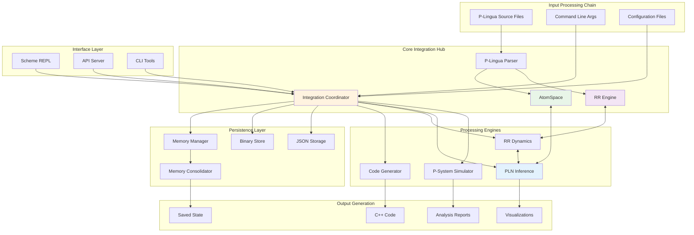
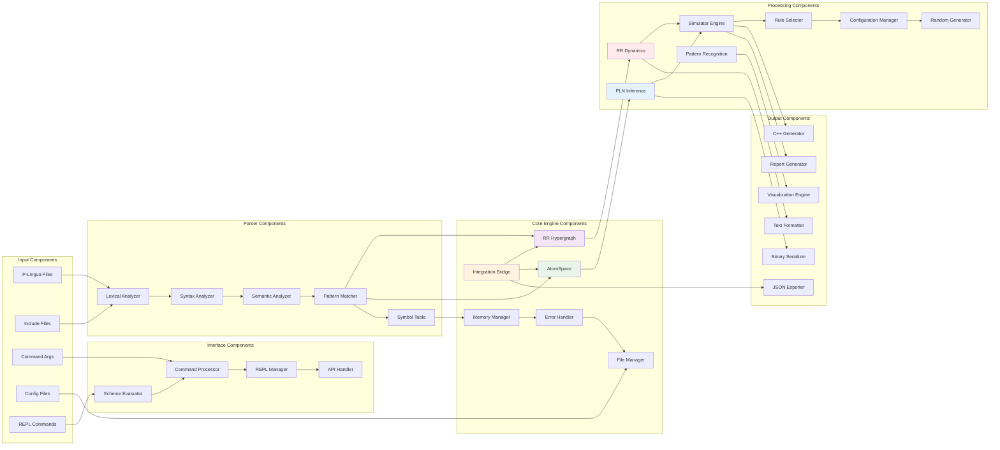
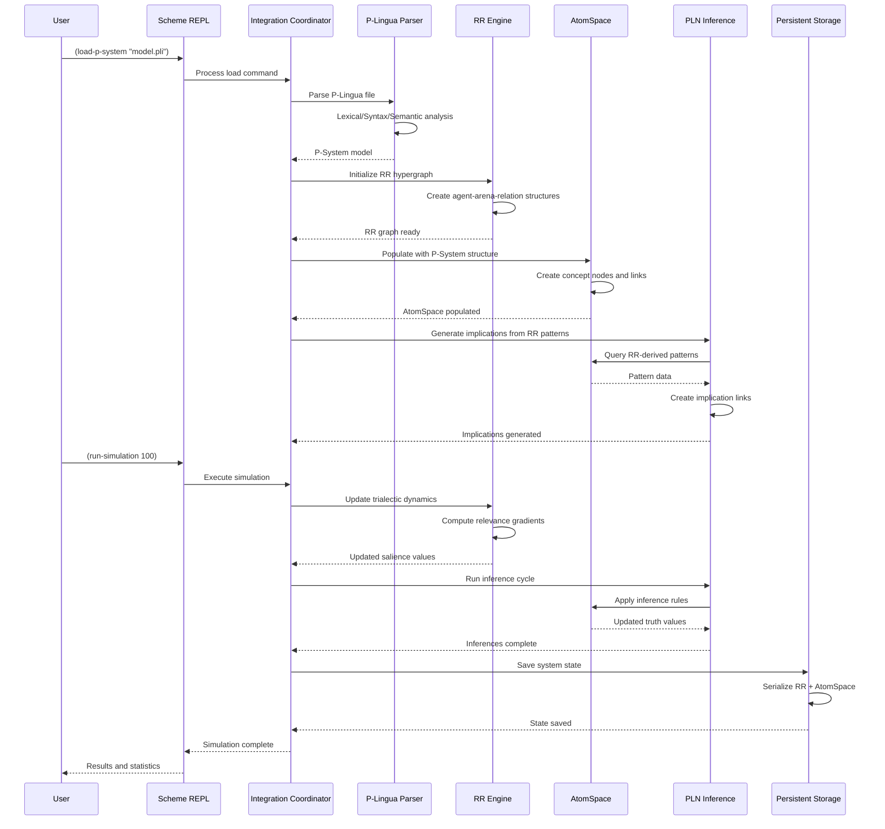
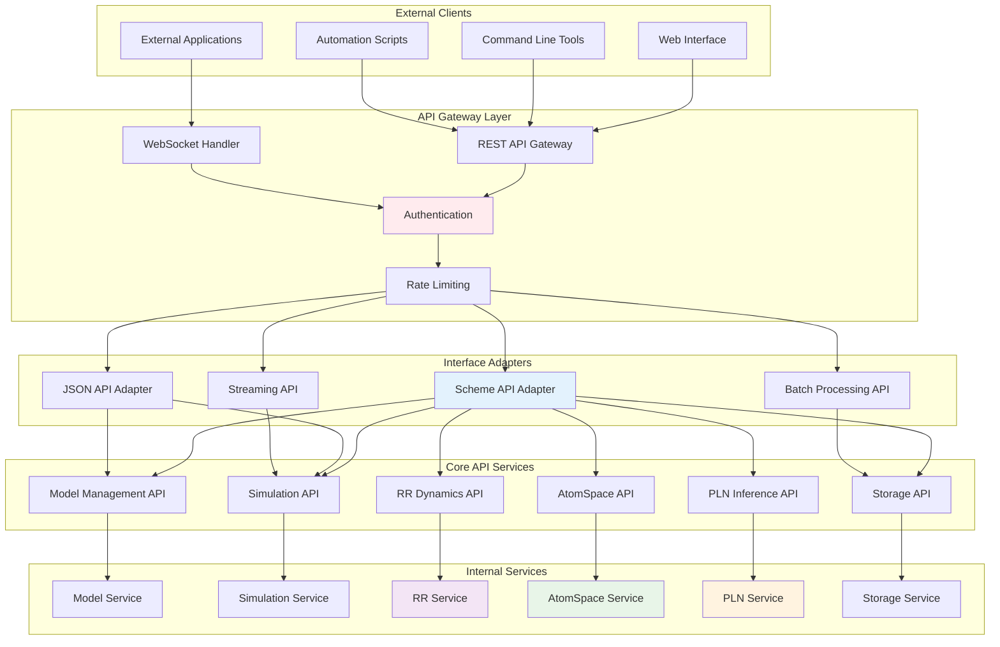
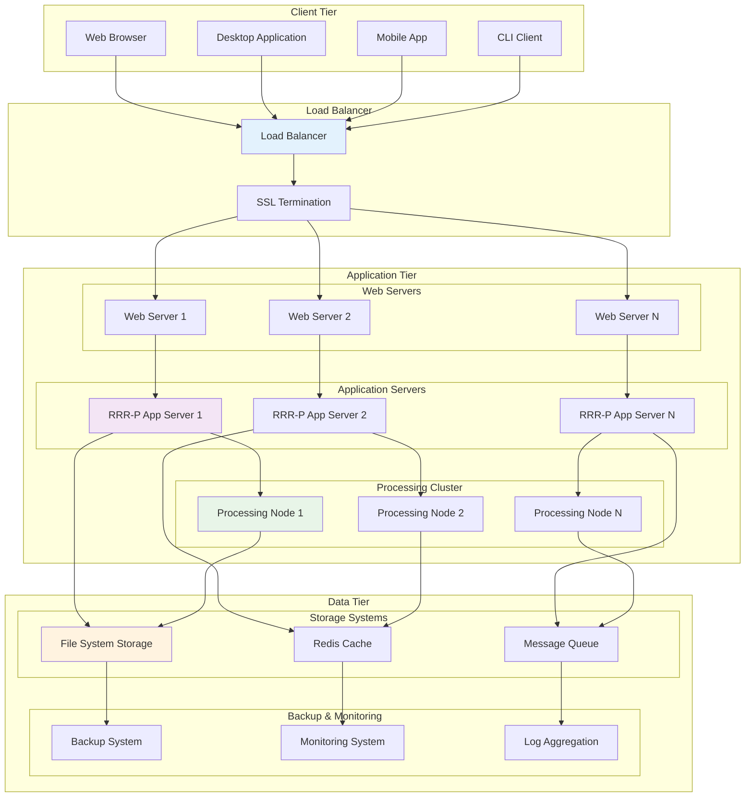
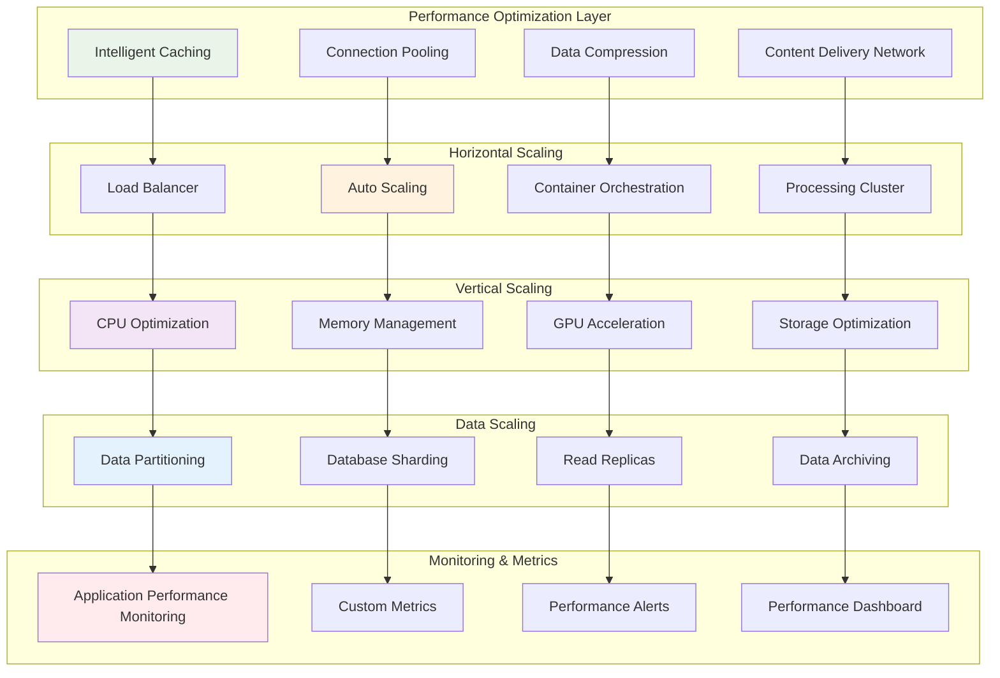
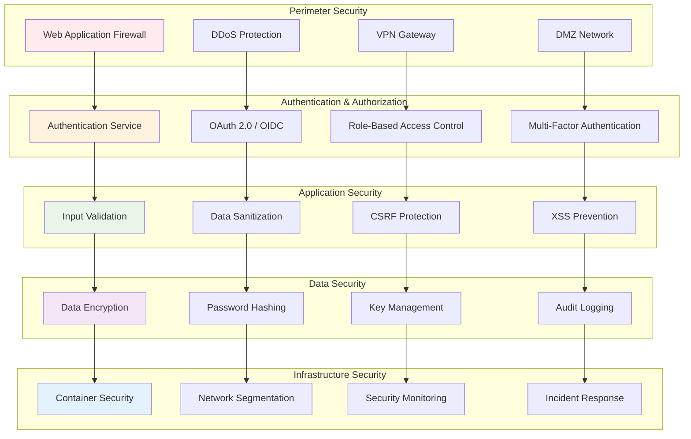

# RRR-P-Systems: Comprehensive Technical Architecture

## Executive Summary

**RRR-P-Systems** is a revolutionary cognitive membrane computing platform that integrates three foundational technologies:

1. **P-Lingua Framework** - Traditional membrane computing with formal P-system modeling
2. **Relevance Realization (RR)** - Cognitive dynamics with trialectic agent-arena-relation structures  
3. **OpenCog AtomSpace** - Symbolic reasoning with Probabilistic Logic Networks (PLN)

This document provides a comprehensive technical architecture overview, covering system integration, data flows, interfaces, deployment, and operational aspects.

## System Architecture Overview

## High-Level Integration Architecture

## Component Interaction Architecture

## Data Flow Architecture

## API Architecture

## Deployment Architecture

## Performance and Scalability Architecture

## Security Architecture

## Operational Architecture

```mermaid
graph LR
    subgraph "Development"
        Dev[Development Environment]
        Test[Testing Environment]
        CI[Continuous Integration]
        CD[Continuous Deployment]
    end
    
    subgraph "Staging"
        Stage[Staging Environment]
        QA[Quality Assurance]
        Perf[Performance Testing]
        Security[Security Testing]
    end
    
    subgraph "Production"
        Prod[Production Environment]
        Blue[Blue Environment]
        Green[Green Environment]
        Canary[Canary Deployment]
    end
    
    subgraph "Monitoring"
        Health[Health Checks]
        Metrics[Metrics Collection]
        Logs[Log Aggregation]
        Alerts[Alert Management]
    end
    
    subgraph "Maintenance"
        Backup[Backup & Recovery]
        Update[System Updates]
        Scale[Scaling Operations]
        Troubleshoot[Troubleshooting]
    end
    
    Dev --> CI
    Test --> CI
    CI --> CD
    CD --> Stage
    
    Stage --> QA
    QA --> Perf
    Perf --> Security
    Security --> Prod
    
    Prod --> Blue
    Blue --> Green
    Green --> Canary
    
    Canary --> Health
    Health --> Metrics
    Metrics --> Logs
    Logs --> Alerts
    
    Alerts --> Backup
    Backup --> Update
    Update --> Scale
    Scale --> Troubleshoot
    
    style CI fill:#e8f5e8
    style Stage fill:#fff3e0
    style Prod fill:#f3e5f5
    style Health fill:#e3f2fd
    style Backup fill:#ffebee
```

## Architecture Principles and Design Patterns

### Core Principles

1. **Modularity**: Clear separation between P-Lingua, RR, and AtomSpace components
2. **Extensibility**: Plugin architecture for custom models, formats, and optimizations
3. **Performance**: Optimized data structures and algorithms for large-scale processing
4. **Reliability**: Comprehensive error handling and recovery mechanisms
5. **Scalability**: Horizontal and vertical scaling capabilities
6. **Maintainability**: Clean code architecture with comprehensive documentation

### Design Patterns

- **Bridge Pattern**: Integration between RR dynamics and AtomSpace symbolic reasoning
- **Strategy Pattern**: Pluggable algorithms for simulation, optimization, and code generation
- **Observer Pattern**: Event-driven updates across integrated components
- **Factory Pattern**: Creation of P-system models, RR structures, and AtomSpace configurations
- **Command Pattern**: Scheme REPL command processing and API operations
- **Repository Pattern**: Data persistence and serialization abstraction

## Technology Stack

### Core Technologies
- **C++11/14**: High-performance system implementation
- **Boost Libraries**: System utilities and data structures
- **OpenCog AtomSpace**: Symbolic knowledge representation
- **PLN**: Probabilistic logic networks for uncertain reasoning
- **Cereal**: Binary and JSON serialization framework

### Build and Development
- **Make**: Build system automation
- **Flex/Bison**: Parser generator tools
- **GCC**: C++ compiler toolchain
- **Git**: Version control system

### Integration and APIs
- **JSON**: Data exchange format
- **Scheme**: Interactive scripting interface
- **REST**: API architecture pattern
- **WebSockets**: Real-time communication

## Documentation Map

This comprehensive technical architecture is supported by detailed component documentation:

- **[ARCHITECTURE.md](ARCHITECTURE.md)** - RR-Enhanced P-Lingua core architecture
- **[COMPONENTS.md](COMPONENTS.md)** - Detailed component analysis and patterns
- **[RR_ARCHITECTURE.md](RR_ARCHITECTURE.md)** - Relevance Realization framework specifics
- **[RR_PROCESS_FLOWS.md](RR_PROCESS_FLOWS.md)** - Detailed process flow diagrams
- **[EXAMPLES.md](EXAMPLES.md)** - Usage examples and integration patterns
- **[README.md](README.md)** - Documentation index and navigation

## Conclusion

The RRR-P-Systems architecture represents a sophisticated integration of membrane computing, cognitive dynamics, and symbolic reasoning. This comprehensive technical architecture provides the foundation for understanding, extending, and operating the system at scale.

Key architectural strengths:
- **Unified cognitive computing platform** combining symbolic and subsymbolic processing
- **Modular, extensible design** supporting diverse applications and customizations
- **High-performance implementation** optimized for complex computational workloads
- **Comprehensive integration framework** bridging multiple paradigms seamlessly
- **Production-ready architecture** with security, monitoring, and operational considerations

This architecture enables advanced applications in cognitive computing, artificial intelligence research, complex systems modeling, and membrane computing applications.