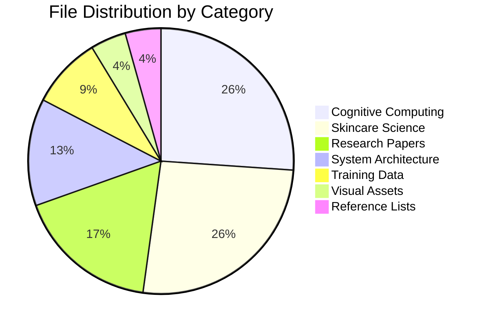
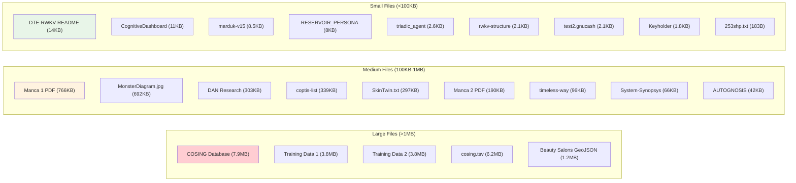
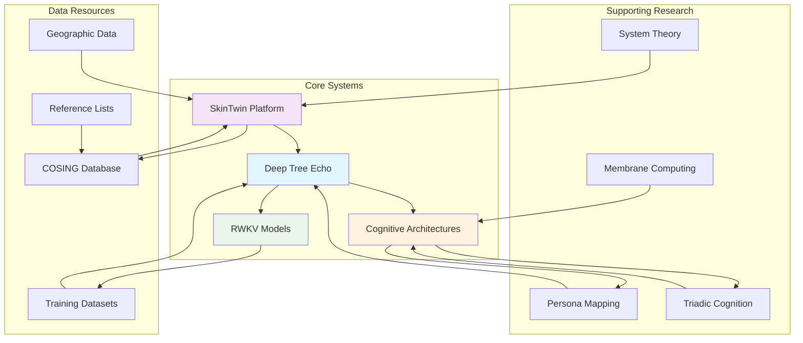

# Reference Files Index

This document provides a complete index of all files in the ref/ folder with detailed metadata and quick access information.

## File Inventory (23 files total)

| # | Filename | Type | Size | Category | Quick Description |
|---|----------|------|------|----------|-------------------|
| 1 | `253shp.txt` | Text | 183B | System | System hash identifiers and references |
| 2 | `AUTOGNOSIS - THE THEORY OF HIERARCHICAL SELF-IMAGE BUILDING SYSTEMS.docx` | Document | 42KB | Research | Hierarchical self-image building theory |
| 3 | `Beauty Salons in SA - DAN v3.geojson` | GeoJSON | 1.2MB | Data | South African beauty salon geographic data |
| 4 | `COSING_Ingredients-Fragrance Inventory_v2x.xlsx` | Excel | 7.9MB | Database | International cosmetic ingredients database |
| 5 | `CognitiveDashboard.tsx` | React | 11KB | Interface | Cognitive processing visualization component |
| 6 | `DAN - Skincare Intervention Model Development _ Cassidy.md` | Markdown | 303KB | Research | Comprehensive skincare intervention model |
| 7 | `DTE-RWKV-README.md` | Markdown | 14KB | Documentation | Deep Tree Echo WebVM-RWKV integration guide |
| 8 | `Keyholder.md` | Markdown | 1.8KB | Summary | Deep Tree Echo development session summary |
| 9 | `Manca 1 - Enumerating Membrane Structures (1).pdf` | PDF | 766KB | Academic | Membrane structure enumeration research |
| 10 | `Manca 2 - A Recurrent Enumeration of Free Hypermultisets (1).pdf` | PDF | 190KB | Academic | Hypermultiset enumeration mathematics |
| 11 | `MonsterDiagram.jpg` | Image | 692KB | Visual | System architecture visualization diagram |
| 12 | `RESERVOIR_PERSONA_MAPPING.md` | Markdown | 8KB | Documentation | Persona-to-reservoir parameter mapping guide |
| 13 | `SkinTwin.txt` | Text | 297KB | Design | SkinTwin R&D architecture and organization |
| 14 | `System-Synopsys-v1.md` | Markdown | 66KB | Academic | System basics and cosmic order analysis |
| 15 | `coptis-list-1.md` | Markdown | 339KB | Reference | Coptis cosmetic company URL directory |
| 16 | `cosing.tsv` | TSV | 6.2MB | Dataset | Tab-separated cosmetic ingredients data |
| 17 | `g-3xLgPGYzA-deep-tree-echo_c-6729f9a1-4d94-8005-8885-c51a9513b3a3-mod.jsonl` | JSONL | 3.8MB | Training | Deep Tree Echo conversation training data |
| 18 | `g-3xLgPGYzA-deep-tree-echo_c-mod.jsonl` | JSONL | 3.8MB | Training | Modified Deep Tree Echo training dataset |
| 19 | `marduk-v15-extended.md` | Markdown | 8.5KB | Persona | Marduk AI systems architect persona definition |
| 20 | `rwkv-structure.md` | Markdown | 2.1KB | Technical | RWKV language model implementation structure |
| 21 | `test2.gnucash` | GnuCash | 2.1KB | Data | Financial test data file |
| 22 | `timeless-way-italics-only.txt` | Text | 96KB | Extract | Italicized text from architectural theory |
| 23 | `triadic_agent_system.yaml` | YAML | 2.6KB | Config | Triadic cognition system configuration |

## Quick Access by File Type

### Documentation Files (.md)
- `DTE-RWKV-README.md` - Deep Tree Echo integration
- `Keyholder.md` - Development session notes
- `RESERVOIR_PERSONA_MAPPING.md` - Persona mapping guide
- `System-Synopsys-v1.md` - System theory foundations
- `coptis-list-1.md` - Industry resource URLs
- `marduk-v15-extended.md` - AI persona specifications
- `rwkv-structure.md` - RWKV technical structure

### Research Documents
- `DAN - Skincare Intervention Model Development _ Cassidy.md` - Core research
- `AUTOGNOSIS - THE THEORY OF HIERARCHICAL SELF-IMAGE BUILDING SYSTEMS.docx` - Theory document
- `Manca 1 - Enumerating Membrane Structures (1).pdf` - Academic paper
- `Manca 2 - A Recurrent Enumeration of Free Hypermultisets (1).pdf` - Academic paper

### Data Files
- `Beauty Salons in SA - DAN v3.geojson` - Geographic data
- `COSING_Ingredients-Fragrance Inventory_v2x.xlsx` - Ingredients database
- `cosing.tsv` - Ingredients dataset
- `g-3xLgPGYzA-deep-tree-echo_c-6729f9a1-4d94-8005-8885-c51a9513b3a3-mod.jsonl` - Training data
- `g-3xLgPGYzA-deep-tree-echo_c-mod.jsonl` - Training data
- `test2.gnucash` - Financial data

### Code & Configuration
- `CognitiveDashboard.tsx` - React component
- `triadic_agent_system.yaml` - System configuration

### Text & Reference
- `253shp.txt` - System identifiers
- `SkinTwin.txt` - System design document
- `timeless-way-italics-only.txt` - Text extract

### Visual Assets
- `MonsterDiagram.jpg` - Architecture diagram

## Content Categories with File Counts

## File Size Distribution

## Key Integration Points

### Primary Ecosystems
1. **Deep Tree Echo Ecosystem**
   - `DTE-RWKV-README.md`
   - `CognitiveDashboard.tsx`
   - `g-3xLgPGYzA-deep-tree-echo_c-*.jsonl`
   - `Keyholder.md`

2. **SkinTwin Platform**
   - `SkinTwin.txt`
   - `DAN - Skincare Intervention Model Development _ Cassidy.md`
   - `COSING_Ingredients-Fragrance Inventory_v2x.xlsx`
   - `cosing.tsv`

3. **Cognitive Architecture Framework**
   - `RESERVOIR_PERSONA_MAPPING.md`
   - `triadic_agent_system.yaml`
   - `marduk-v15-extended.md`
   - `rwkv-structure.md`

### Cross-References and Dependencies

## Usage Recommendations

### For New Users
1. Start with `README.md` for system overview
2. Review `DTE-RWKV-README.md` for technical architecture
3. Examine `SkinTwin.txt` for domain-specific applications

### For Developers
1. Study `CognitiveDashboard.tsx` for interface patterns
2. Reference `rwkv-structure.md` for model implementation
3. Use `triadic_agent_system.yaml` for agent configuration

### For Researchers
1. Begin with academic PDFs for theoretical foundation
2. Review `System-Synopsys-v1.md` for philosophical framework
3. Examine training data files for empirical examples

### For Domain Experts
1. Access COSING database files for ingredient information
2. Review geographic data for market analysis
3. Study intervention models for application strategies

## Maintenance Notes

- Total collection size: ~26MB
- File types: 8 different formats
- Last updated: August 29, 2025
- Source commit: d4caf5dbff86b12f72ad2f2e974714ca0ca3d457

This index serves as a comprehensive guide to navigating the reference collection efficiently and understanding the relationships between different components of the system.