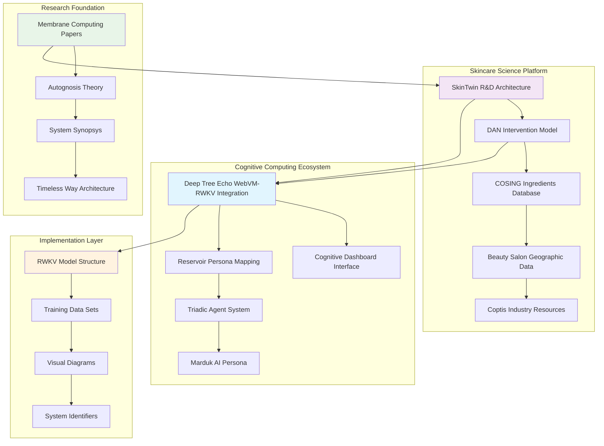
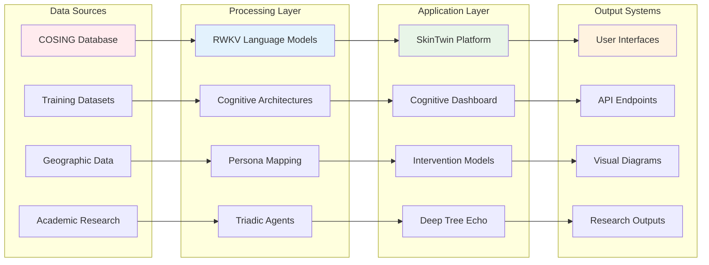
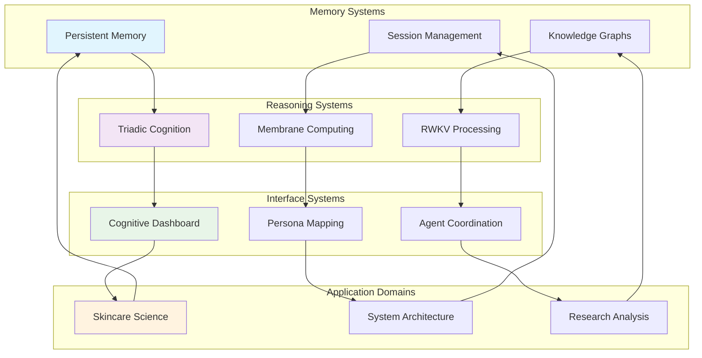
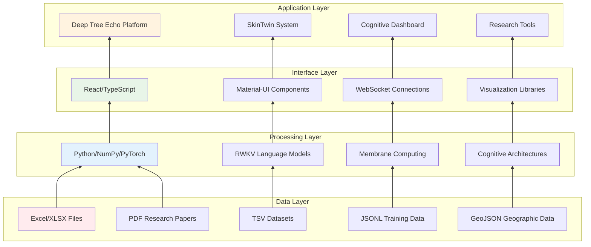

# Reference Files Collection - Summary Documentation

This folder contains 23 recently added files from the skin9ml repository, organized here as a reference collection. These files represent a diverse ecosystem of research, development, and implementation materials spanning skincare science, cognitive computing, machine learning, and systems architecture.

## File Organization by Category

### 🧠 Cognitive Computing & AI Architecture
| File | Type | Description |
|------|------|-------------|
| `DTE-RWKV-README.md` | Documentation | Deep Tree Echo WebVM-RWKV Integration - Revolutionary cognitive architecture platform |
| `CognitiveDashboard.tsx` | React Component | Real-time cognitive processing visualization interface |
| `RESERVOIR_PERSONA_MAPPING.md` | Documentation | Persona-to-reservoir parameter mapping for cognitive systems |
| `triadic_agent_system.yaml` | Configuration | Triadic cognition system with 3 functional sub-agents |
| `marduk-v15-extended.md` | Persona Definition | Systems architect mad scientist persona specification |
| `rwkv-structure.md` | Technical Doc | RWKV language model implementation structure |

### 🧴 Skincare & Cosmetic Science
| File | Type | Description |
|------|------|-------------|
| `DAN - Skincare Intervention Model Development _ Cassidy.md` | Research Paper | Comprehensive skincare intervention model development |
| `SkinTwin.txt` | System Design | SkinTwin R&D project organization and OpenCog AGI architecture |
| `COSING_Ingredients-Fragrance Inventory_v2x.xlsx` | Database | International cosmetic ingredients database |
| `cosing.tsv` | Dataset | Tab-separated cosmetic ingredients data |
| `coptis-list-1.md` | Reference | URL list for Coptis cosmetic company resources |
| `Beauty Salons in SA - DAN v3.geojson` | Geographic Data | South African beauty salon locations |

### 📊 Research & Academic Papers
| File | Type | Description |
|------|------|-------------|
| `Manca 1 - Enumerating Membrane Structures (1).pdf` | Academic Paper | Membrane structure enumeration research |
| `Manca 2 - A Recurrent Enumeration of Free Hypermultisets (1).pdf` | Academic Paper | Hypermultiset enumeration mathematical research |
| `AUTOGNOSIS - THE THEORY OF HIERARCHICAL SELF-IMAGE BUILDING SYSTEMS.docx` | Research Doc | Theory of hierarchical self-image building systems |
| `System-Synopsys-v1.md` | Academic Text | System basics and cosmic order delineation |
| `timeless-way-italics-only.txt` | Text Extract | Extracted italicized content from architectural text |

### 🔬 System Architecture & Theory
| File | Type | Description |
|------|------|-------------|
| `Keyholder.md` | Session Summary | Deep Tree Echo development strategy and memory systems |
| `253shp.txt` | System ID | System hash identifiers and references |
| `test2.gnucash` | Financial Data | GnuCash financial test data |

### 🎨 Visual & Media Assets
| File | Type | Description |
|------|------|-------------|
| `MonsterDiagram.jpg` | Diagram | Visual system architecture representation |

### 📁 Training & Model Data
| File | Type | Description |
|------|------|-------------|
| `g-3xLgPGYzA-deep-tree-echo_c-6729f9a1-4d94-8005-8885-c51a9513b3a3-mod.jsonl` | Training Data | Deep Tree Echo conversation/training data |
| `g-3xLgPGYzA-deep-tree-echo_c-mod.jsonl` | Training Data | Modified Deep Tree Echo training dataset |

## System Architecture Overview

## Data Flow and Integration Patterns

## Cognitive Architecture Integration

## Technology Stack and Dependencies

## Key Relationships and Connections

### Primary Integration Points

1. **Deep Tree Echo ↔ RWKV Models**: Core language processing integration
2. **SkinTwin ↔ COSING Database**: Skincare ingredient data integration
3. **Cognitive Dashboard ↔ Triadic Agents**: Real-time system monitoring
4. **Membrane Computing ↔ System Architecture**: Theoretical foundation

### Cross-Domain Connections

1. **Research Papers → System Implementation**: Academic research informing practical systems
2. **Geographic Data → Business Intelligence**: Location-based skincare market analysis
3. **Training Data → Persona Development**: Machine learning powering AI personality systems
4. **Visual Diagrams → System Documentation**: Graphical representation of complex architectures

## Usage and Implementation Guidelines

### For Developers
- Reference `rwkv-structure.md` for RWKV implementation patterns
- Use `CognitiveDashboard.tsx` as a template for cognitive system interfaces
- Follow `triadic_agent_system.yaml` for multi-agent coordination patterns

### For Researchers
- Build upon membrane computing papers for theoretical foundations
- Reference `System-Synopsys-v1.md` for cosmic order modeling
- Use `AUTOGNOSIS` document for hierarchical system theories

### For Skincare Scientists
- Access `COSING_Ingredients-Fragrance Inventory_v2x.xlsx` for ingredient data
- Reference `DAN - Skincare Intervention Model Development _ Cassidy.md` for intervention strategies
- Use `Beauty Salons in SA - DAN v3.geojson` for market geographical analysis

### For System Architects
- Follow `SkinTwin.txt` for OpenCog AGI architecture patterns
- Reference `RESERVOIR_PERSONA_MAPPING.md` for personality-parameter mapping
- Use `marduk-v15-extended.md` for AI persona development guidelines

## Future Development Directions

Based on the file collection, potential development directions include:

1. **Enhanced Cognitive Integration**: Deeper integration between RWKV models and cognitive architectures
2. **Expanded Skincare Platform**: Broader integration of cosmetic science data and AI reasoning
3. **Advanced Visualization**: More sophisticated cognitive process visualization
4. **Multi-Domain Applications**: Extending the architecture to domains beyond skincare
5. **Real-time Adaptation**: Dynamic system adaptation based on user interaction patterns

## Conclusion

This reference collection represents a comprehensive ecosystem spanning multiple domains of research and application. The files demonstrate sophisticated integration between cognitive computing, skincare science, and systems architecture, providing a foundation for advanced AI-powered applications in specialized domains.

The collection serves as both a reference library and a blueprint for future development, offering insights into the integration of theoretical research with practical implementation across multiple technological and scientific domains.